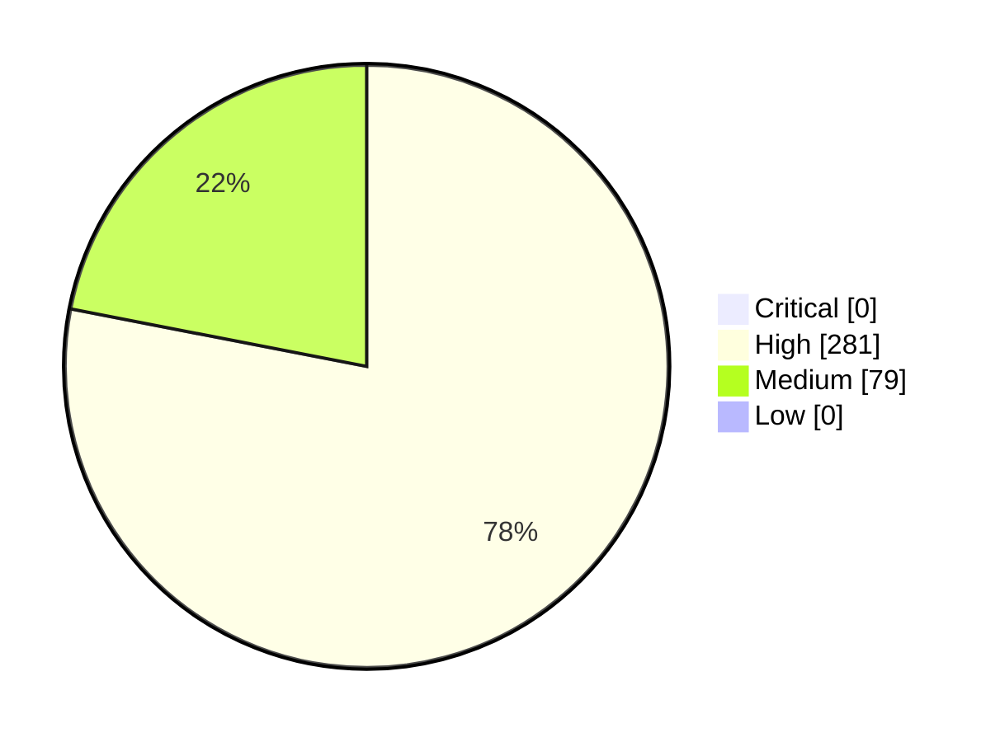

# Figma Design Audit Report · Internet Banking Platform Design System

- Generated at: 2026-02-11T05:11:15.482Z
- Selection source: `/workspace/inputs/figma/dashboard-selection.json`
- Variables source: `/workspace/inputs/figma/dashboard-variables.json`
- Rules: `/workspace/skills/figma-design-audit/rules/default-rules.json`
- Allowed library variables: `/workspace/inputs/figma/design-system-variables.json`

## Audit summary

| Metric | Value |
|---|---:|
| Nodes audited | 630 |
| Violations | 360 |
| Critical | 0 |
| High | 281 |
| Medium | 79 |
| Low | 0 |



## Most impacted journeys/screens

| Journey / Screen | Violation count |
|---|---:|
| Dashboard default - Transaction and savings - lg | 360 |

## Detailed violations

| ID | Severity | Rule | Journey | Node | Property | Actual | Expected | Suggested fix |
|---|---|---|---|---|---|---|---|---|
| V-0001 | high | color_off_brand | Dashboard default - Transaction and savings - lg | Dashboard default - Transaction and savings - lg | layoutGrids.0.color | #FF00001A | Approved brand color token/value | Replace this color with a brand-approved token from the active theme/mode. |
| V-0037 | high | missing_variable_reference | Dashboard default - Transaction and savings - lg | Dashboard default - Transaction and savings - lg > Content > Account card | background.0.color | #FFFFFF | Variable reference for color | Bind color to a published semantic token. |
| V-0038 | high | missing_variable_reference | Dashboard default - Transaction and savings - lg | Dashboard default - Transaction and savings - lg > Content > Account card | backgroundColor | #00000000 | Variable reference for color | Bind color to a published semantic token. |
| V-0039 | high | missing_variable_reference | Dashboard default - Transaction and savings - lg | Dashboard default - Transaction and savings - lg > Content > Account card | fills.0.color | #FFFFFF | Variable reference for color | Bind color to a published semantic token. |
| V-0109 | high | missing_variable_reference | Dashboard default - Transaction and savings - lg | Dashboard default - Transaction and savings - lg > Content > Account card | background.0.color | #FFFFFF | Variable reference for color | Bind color to a published semantic token. |
| V-0110 | high | missing_variable_reference | Dashboard default - Transaction and savings - lg | Dashboard default - Transaction and savings - lg > Content > Account card | backgroundColor | #00000000 | Variable reference for color | Bind color to a published semantic token. |
| V-0111 | high | missing_variable_reference | Dashboard default - Transaction and savings - lg | Dashboard default - Transaction and savings - lg > Content > Account card | fills.0.color | #FFFFFF | Variable reference for color | Bind color to a published semantic token. |
| V-0040 | high | missing_variable_reference | Dashboard default - Transaction and savings - lg | Dashboard default - Transaction and savings - lg > Content > Account card > .Account card item | backgroundColor | #00000000 | Variable reference for color | Bind color to a published semantic token. |
| V-0041 | high | color_off_brand | Dashboard default - Transaction and savings - lg | Dashboard default - Transaction and savings - lg > Content > Account card > .Account card item | effects.0.color | #26344503 | Approved brand color token/value | Replace this color with a brand-approved token from the active theme/mode. |
| V-0042 | high | missing_variable_reference | Dashboard default - Transaction and savings - lg | Dashboard default - Transaction and savings - lg > Content > Account card > .Account card item | effects.0.color | #26344503 | Variable reference for color | Bind color to a published semantic token. |
| V-0112 | high | missing_variable_reference | Dashboard default - Transaction and savings - lg | Dashboard default - Transaction and savings - lg > Content > Account card > .Account card item | backgroundColor | #00000000 | Variable reference for color | Bind color to a published semantic token. |
| V-0113 | high | color_off_brand | Dashboard default - Transaction and savings - lg | Dashboard default - Transaction and savings - lg > Content > Account card > .Account card item | effects.0.color | #26344503 | Approved brand color token/value | Replace this color with a brand-approved token from the active theme/mode. |
| V-0114 | high | missing_variable_reference | Dashboard default - Transaction and savings - lg | Dashboard default - Transaction and savings - lg > Content > Account card > .Account card item | effects.0.color | #26344503 | Variable reference for color | Bind color to a published semantic token. |
| V-0082 | high | missing_variable_reference | Dashboard default - Transaction and savings - lg | Dashboard default - Transaction and savings - lg > Content > Account card > .Account card item > .Input message item | background.0.color | #FFFFFF | Variable reference for color | Bind color to a published semantic token. |
| V-0083 | high | missing_variable_reference | Dashboard default - Transaction and savings - lg | Dashboard default - Transaction and savings - lg > Content > Account card > .Account card item > .Input message item | backgroundColor | #00000000 | Variable reference for color | Bind color to a published semantic token. |
| V-0084 | high | missing_variable_reference | Dashboard default - Transaction and savings - lg | Dashboard default - Transaction and savings - lg > Content > Account card > .Account card item > .Input message item | fills.0.color | #FFFFFF | Variable reference for color | Bind color to a published semantic token. |
| V-0154 | high | missing_variable_reference | Dashboard default - Transaction and savings - lg | Dashboard default - Transaction and savings - lg > Content > Account card > .Account card item > .Input message item | background.0.color | #FFFFFF | Variable reference for color | Bind color to a published semantic token. |
| V-0155 | high | missing_variable_reference | Dashboard default - Transaction and savings - lg | Dashboard default - Transaction and savings - lg > Content > Account card > .Account card item > .Input message item | backgroundColor | #00000000 | Variable reference for color | Bind color to a published semantic token. |
| V-0156 | high | missing_variable_reference | Dashboard default - Transaction and savings - lg | Dashboard default - Transaction and savings - lg > Content > Account card > .Account card item > .Input message item | fills.0.color | #FFFFFF | Variable reference for color | Bind color to a published semantic token. |
| V-0085 | high | missing_variable_reference | Dashboard default - Transaction and savings - lg | Dashboard default - Transaction and savings - lg > Content > Account card > .Account card item > .Input message item > Icon | backgroundColor | #00000000 | Variable reference for color | Bind color to a published semantic token. |
| V-0157 | high | missing_variable_reference | Dashboard default - Transaction and savings - lg | Dashboard default - Transaction and savings - lg > Content > Account card > .Account card item > .Input message item > Icon | backgroundColor | #00000000 | Variable reference for color | Bind color to a published semantic token. |
| V-0086 | high | missing_variable_reference | Dashboard default - Transaction and savings - lg | Dashboard default - Transaction and savings - lg > Content > Account card > .Account card item > .Input message item > Icon > info | backgroundColor | #00000000 | Variable reference for color | Bind color to a published semantic token. |
| V-0158 | high | missing_variable_reference | Dashboard default - Transaction and savings - lg | Dashboard default - Transaction and savings - lg > Content > Account card > .Account card item > .Input message item > Icon > info | backgroundColor | #00000000 | Variable reference for color | Bind color to a published semantic token. |
| V-0087 | high | missing_variable_reference | Dashboard default - Transaction and savings - lg | Dashboard default - Transaction and savings - lg > Content > Account card > .Account card item > .Input message item > Message | backgroundColor | #00000000 | Variable reference for color | Bind color to a published semantic token. |
| V-0159 | high | missing_variable_reference | Dashboard default - Transaction and savings - lg | Dashboard default - Transaction and savings - lg > Content > Account card > .Account card item > .Input message item > Message | backgroundColor | #00000000 | Variable reference for color | Bind color to a published semantic token. |
| V-0088 | high | missing_variable_reference | Dashboard default - Transaction and savings - lg | Dashboard default - Transaction and savings - lg > Content > Account card > .Account card item > .Input message item > Message > Message | style.letterSpacing | 0 | Variable reference for spacing | Bind spacing value to the spacing token in your variable collection. |
| V-0089 | high | missing_variable_reference | Dashboard default - Transaction and savings - lg | Dashboard default - Transaction and savings - lg > Content > Account card > .Account card item > .Input message item > Message > Message | style.paragraphSpacing | 14 | Variable reference for spacing | Bind spacing value to the spacing token in your variable collection. |
| V-0160 | high | missing_variable_reference | Dashboard default - Transaction and savings - lg | Dashboard default - Transaction and savings - lg > Content > Account card > .Account card item > .Input message item > Message > Message | style.letterSpacing | 0 | Variable reference for spacing | Bind spacing value to the spacing token in your variable collection. |
| V-0161 | high | missing_variable_reference | Dashboard default - Transaction and savings - lg | Dashboard default - Transaction and savings - lg > Content > Account card > .Account card item > .Input message item > Message > Message | style.paragraphSpacing | 14 | Variable reference for spacing | Bind spacing value to the spacing token in your variable collection. |
| V-0056 | high | missing_variable_reference | Dashboard default - Transaction and savings - lg | Dashboard default - Transaction and savings - lg > Content > Account card > .Account card item > Card > Balances | backgroundColor | #00000000 | Variable reference for color | Bind color to a published semantic token. |
| V-0128 | high | missing_variable_reference | Dashboard default - Transaction and savings - lg | Dashboard default - Transaction and savings - lg > Content > Account card > .Account card item > Card > Balances | backgroundColor | #00000000 | Variable reference for color | Bind color to a published semantic token. |
| V-0057 | high | missing_variable_reference | Dashboard default - Transaction and savings - lg | Dashboard default - Transaction and savings - lg > Content > Account card > .Account card item > Card > Balances > Available | backgroundColor | #00000000 | Variable reference for color | Bind color to a published semantic token. |
| V-0129 | high | missing_variable_reference | Dashboard default - Transaction and savings - lg | Dashboard default - Transaction and savings - lg > Content > Account card > .Account card item > Card > Balances > Available | backgroundColor | #00000000 | Variable reference for color | Bind color to a published semantic token. |
| V-0062 | high | missing_variable_reference | Dashboard default - Transaction and savings - lg | Dashboard default - Transaction and savings - lg > Content > Account card > .Account card item > Card > Balances > Available > Amount | backgroundColor | #00000000 | Variable reference for color | Bind color to a published semantic token. |
| V-0134 | high | missing_variable_reference | Dashboard default - Transaction and savings - lg | Dashboard default - Transaction and savings - lg > Content > Account card > .Account card item > Card > Balances > Available > Amount | backgroundColor | #00000000 | Variable reference for color | Bind color to a published semantic token. |
| V-0063 | high | missing_variable_reference | Dashboard default - Transaction and savings - lg | Dashboard default - Transaction and savings - lg > Content > Account card > .Account card item > Card > Balances > Available > Amount > Amount | style.letterSpacing | 0 | Variable reference for spacing | Bind spacing value to the spacing token in your variable collection. |
| V-0065 | high | missing_variable_reference | Dashboard default - Transaction and savings - lg | Dashboard default - Transaction and savings - lg > Content > Account card > .Account card item > Card > Balances > Available > Amount > Amount | style.paragraphSpacing | 22 | Variable reference for spacing | Bind spacing value to the spacing token in your variable collection. |
| V-0135 | high | missing_variable_reference | Dashboard default - Transaction and savings - lg | Dashboard default - Transaction and savings - lg > Content > Account card > .Account card item > Card > Balances > Available > Amount > Amount | style.letterSpacing | 0 | Variable reference for spacing | Bind spacing value to the spacing token in your variable collection. |
| V-0137 | high | missing_variable_reference | Dashboard default - Transaction and savings - lg | Dashboard default - Transaction and savings - lg > Content > Account card > .Account card item > Card > Balances > Available > Amount > Amount | style.paragraphSpacing | 22 | Variable reference for spacing | Bind spacing value to the spacing token in your variable collection. |
| V-0058 | high | missing_variable_reference | Dashboard default - Transaction and savings - lg | Dashboard default - Transaction and savings - lg > Content > Account card > .Account card item > Card > Balances > Available > Label | backgroundColor | #00000000 | Variable reference for color | Bind color to a published semantic token. |
| V-0130 | high | missing_variable_reference | Dashboard default - Transaction and savings - lg | Dashboard default - Transaction and savings - lg > Content > Account card > .Account card item > Card > Balances > Available > Label | backgroundColor | #00000000 | Variable reference for color | Bind color to a published semantic token. |
| V-0059 | high | missing_variable_reference | Dashboard default - Transaction and savings - lg | Dashboard default - Transaction and savings - lg > Content > Account card > .Account card item > Card > Balances > Available > Label > Label | style.letterSpacing | 0 | Variable reference for spacing | Bind spacing value to the spacing token in your variable collection. |
| V-0060 | high | missing_variable_reference | Dashboard default - Transaction and savings - lg | Dashboard default - Transaction and savings - lg > Content > Account card > .Account card item > Card > Balances > Available > Label > Label | style.paragraphSpacing | 12 | Variable reference for spacing | Bind spacing value to the spacing token in your variable collection. |
| V-0131 | high | missing_variable_reference | Dashboard default - Transaction and savings - lg | Dashboard default - Transaction and savings - lg > Content > Account card > .Account card item > Card > Balances > Available > Label > Label | style.letterSpacing | 0 | Variable reference for spacing | Bind spacing value to the spacing token in your variable collection. |
| V-0132 | high | missing_variable_reference | Dashboard default - Transaction and savings - lg | Dashboard default - Transaction and savings - lg > Content > Account card > .Account card item > Card > Balances > Available > Label > Label | style.paragraphSpacing | 12 | Variable reference for spacing | Bind spacing value to the spacing token in your variable collection. |
| V-0068 | high | missing_variable_reference | Dashboard default - Transaction and savings - lg | Dashboard default - Transaction and savings - lg > Content > Account card > .Account card item > Card > Balances > Balance | backgroundColor | #00000000 | Variable reference for color | Bind color to a published semantic token. |
| V-0140 | high | missing_variable_reference | Dashboard default - Transaction and savings - lg | Dashboard default - Transaction and savings - lg > Content > Account card > .Account card item > Card > Balances > Balance | backgroundColor | #00000000 | Variable reference for color | Bind color to a published semantic token. |
| V-0073 | high | missing_variable_reference | Dashboard default - Transaction and savings - lg | Dashboard default - Transaction and savings - lg > Content > Account card > .Account card item > Card > Balances > Balance > Amount | backgroundColor | #00000000 | Variable reference for color | Bind color to a published semantic token. |
| V-0145 | high | missing_variable_reference | Dashboard default - Transaction and savings - lg | Dashboard default - Transaction and savings - lg > Content > Account card > .Account card item > Card > Balances > Balance > Amount | backgroundColor | #00000000 | Variable reference for color | Bind color to a published semantic token. |
| V-0074 | high | missing_variable_reference | Dashboard default - Transaction and savings - lg | Dashboard default - Transaction and savings - lg > Content > Account card > .Account card item > Card > Balances > Balance > Amount > Amount | style.letterSpacing | 0 | Variable reference for spacing | Bind spacing value to the spacing token in your variable collection. |
| V-0075 | high | missing_variable_reference | Dashboard default - Transaction and savings - lg | Dashboard default - Transaction and savings - lg > Content > Account card > .Account card item > Card > Balances > Balance > Amount > Amount | style.paragraphSpacing | 14 | Variable reference for spacing | Bind spacing value to the spacing token in your variable collection. |
| V-0146 | high | missing_variable_reference | Dashboard default - Transaction and savings - lg | Dashboard default - Transaction and savings - lg > Content > Account card > .Account card item > Card > Balances > Balance > Amount > Amount | style.letterSpacing | 0 | Variable reference for spacing | Bind spacing value to the spacing token in your variable collection. |
| V-0147 | high | missing_variable_reference | Dashboard default - Transaction and savings - lg | Dashboard default - Transaction and savings - lg > Content > Account card > .Account card item > Card > Balances > Balance > Amount > Amount | style.paragraphSpacing | 14 | Variable reference for spacing | Bind spacing value to the spacing token in your variable collection. |
| V-0069 | high | missing_variable_reference | Dashboard default - Transaction and savings - lg | Dashboard default - Transaction and savings - lg > Content > Account card > .Account card item > Card > Balances > Balance > Label | backgroundColor | #00000000 | Variable reference for color | Bind color to a published semantic token. |
| V-0141 | high | missing_variable_reference | Dashboard default - Transaction and savings - lg | Dashboard default - Transaction and savings - lg > Content > Account card > .Account card item > Card > Balances > Balance > Label | backgroundColor | #00000000 | Variable reference for color | Bind color to a published semantic token. |
| V-0070 | high | missing_variable_reference | Dashboard default - Transaction and savings - lg | Dashboard default - Transaction and savings - lg > Content > Account card > .Account card item > Card > Balances > Balance > Label > Label | style.letterSpacing | 0 | Variable reference for spacing | Bind spacing value to the spacing token in your variable collection. |
| V-0071 | high | missing_variable_reference | Dashboard default - Transaction and savings - lg | Dashboard default - Transaction and savings - lg > Content > Account card > .Account card item > Card > Balances > Balance > Label > Label | style.paragraphSpacing | 12 | Variable reference for spacing | Bind spacing value to the spacing token in your variable collection. |
| V-0142 | high | missing_variable_reference | Dashboard default - Transaction and savings - lg | Dashboard default - Transaction and savings - lg > Content > Account card > .Account card item > Card > Balances > Balance > Label > Label | style.letterSpacing | 0 | Variable reference for spacing | Bind spacing value to the spacing token in your variable collection. |
| V-0143 | high | missing_variable_reference | Dashboard default - Transaction and savings - lg | Dashboard default - Transaction and savings - lg > Content > Account card > .Account card item > Card > Balances > Balance > Label > Label | style.paragraphSpacing | 12 | Variable reference for spacing | Bind spacing value to the spacing token in your variable collection. |
| V-0047 | high | missing_variable_reference | Dashboard default - Transaction and savings - lg | Dashboard default - Transaction and savings - lg > Content > Account card > .Account card item > Card > Header | backgroundColor | #00000000 | Variable reference for color | Bind color to a published semantic token. |
| V-0119 | high | missing_variable_reference | Dashboard default - Transaction and savings - lg | Dashboard default - Transaction and savings - lg > Content > Account card > .Account card item > Card > Header | backgroundColor | #00000000 | Variable reference for color | Bind color to a published semantic token. |
| V-0048 | high | missing_variable_reference | Dashboard default - Transaction and savings - lg | Dashboard default - Transaction and savings - lg > Content > Account card > .Account card item > Card > Header > Account Summary | backgroundColor | #00000000 | Variable reference for color | Bind color to a published semantic token. |
| V-0120 | high | missing_variable_reference | Dashboard default - Transaction and savings - lg | Dashboard default - Transaction and savings - lg > Content > Account card > .Account card item > Card > Header > Account Summary | backgroundColor | #00000000 | Variable reference for color | Bind color to a published semantic token. |
| V-0121 | high | missing_variable_reference | Dashboard default - Transaction and savings - lg | Dashboard default - Transaction and savings - lg > Content > Account card > .Account card item > Card > Header > Account Summary > account / ME / SaveME | backgroundColor | #00000000 | Variable reference for color | Bind color to a published semantic token. |
| V-0049 | high | missing_variable_reference | Dashboard default - Transaction and savings - lg | Dashboard default - Transaction and savings - lg > Content > Account card > .Account card item > Card > Header > Account Summary > account / transaction | backgroundColor | #00000000 | Variable reference for color | Bind color to a published semantic token. |
| V-0050 | high | missing_variable_reference | Dashboard default - Transaction and savings - lg | Dashboard default - Transaction and savings - lg > Content > Account card > .Account card item > Card > Header > Account Summary > Account Names and Number | backgroundColor | #00000000 | Variable reference for color | Bind color to a published semantic token. |
| V-0122 | high | missing_variable_reference | Dashboard default - Transaction and savings - lg | Dashboard default - Transaction and savings - lg > Content > Account card > .Account card item > Card > Header > Account Summary > Account Names and Number | backgroundColor | #00000000 | Variable reference for color | Bind color to a published semantic token. |
| V-0051 | high | missing_variable_reference | Dashboard default - Transaction and savings - lg | Dashboard default - Transaction and savings - lg > Content > Account card > .Account card item > Card > Header > Account Summary > Account Names and Number > Account Name | style.letterSpacing | 0 | Variable reference for spacing | Bind spacing value to the spacing token in your variable collection. |
| V-0052 | high | missing_variable_reference | Dashboard default - Transaction and savings - lg | Dashboard default - Transaction and savings - lg > Content > Account card > .Account card item > Card > Header > Account Summary > Account Names and Number > Account Name | style.paragraphSpacing | 16 | Variable reference for spacing | Bind spacing value to the spacing token in your variable collection. |
| V-0123 | high | missing_variable_reference | Dashboard default - Transaction and savings - lg | Dashboard default - Transaction and savings - lg > Content > Account card > .Account card item > Card > Header > Account Summary > Account Names and Number > Account Name | style.letterSpacing | 0 | Variable reference for spacing | Bind spacing value to the spacing token in your variable collection. |
| V-0124 | high | missing_variable_reference | Dashboard default - Transaction and savings - lg | Dashboard default - Transaction and savings - lg > Content > Account card > .Account card item > Card > Header > Account Summary > Account Names and Number > Account Name | style.paragraphSpacing | 16 | Variable reference for spacing | Bind spacing value to the spacing token in your variable collection. |
| V-0054 | high | missing_variable_reference | Dashboard default - Transaction and savings - lg | Dashboard default - Transaction and savings - lg > Content > Account card > .Account card item > Card > Header > Account Summary > Account Names and Number > Account Number | backgroundColor | #00000000 | Variable reference for color | Bind color to a published semantic token. |
| V-0126 | high | missing_variable_reference | Dashboard default - Transaction and savings - lg | Dashboard default - Transaction and savings - lg > Content > Account card > .Account card item > Card > Header > Account Summary > Account Names and Number > Account Number | backgroundColor | #00000000 | Variable reference for color | Bind color to a published semantic token. |
| V-0055 | high | missing_variable_reference | Dashboard default - Transaction and savings - lg | Dashboard default - Transaction and savings - lg > Content > Account card > .Account card item > Card > Header > chevron right | backgroundColor | #00000000 | Variable reference for color | Bind color to a published semantic token. |
| V-0127 | high | missing_variable_reference | Dashboard default - Transaction and savings - lg | Dashboard default - Transaction and savings - lg > Content > Account card > .Account card item > Card > Header > chevron right | backgroundColor | #00000000 | Variable reference for color | Bind color to a published semantic token. |
| V-0043 | high | missing_variable_reference | Dashboard default - Transaction and savings - lg | Dashboard default - Transaction and savings - lg > Content > Account card > .Account card item > Card group header | backgroundColor | #00000000 | Variable reference for color | Bind color to a published semantic token. |
| V-0115 | high | missing_variable_reference | Dashboard default - Transaction and savings - lg | Dashboard default - Transaction and savings - lg > Content > Account card > .Account card item > Card group header | backgroundColor | #00000000 | Variable reference for color | Bind color to a published semantic token. |
| V-0044 | high | missing_variable_reference | Dashboard default - Transaction and savings - lg | Dashboard default - Transaction and savings - lg > Content > Account card > .Account card item > Card group header > Group header | style.letterSpacing | 0 | Variable reference for spacing | Bind spacing value to the spacing token in your variable collection. |
| V-0045 | high | missing_variable_reference | Dashboard default - Transaction and savings - lg | Dashboard default - Transaction and savings - lg > Content > Account card > .Account card item > Card group header > Group header | style.paragraphSpacing | 12 | Variable reference for spacing | Bind spacing value to the spacing token in your variable collection. |
| V-0116 | high | missing_variable_reference | Dashboard default - Transaction and savings - lg | Dashboard default - Transaction and savings - lg > Content > Account card > .Account card item > Card group header > Group header | style.letterSpacing | 0 | Variable reference for spacing | Bind spacing value to the spacing token in your variable collection. |
| V-0117 | high | missing_variable_reference | Dashboard default - Transaction and savings - lg | Dashboard default - Transaction and savings - lg > Content > Account card > .Account card item > Card group header > Group header | style.paragraphSpacing | 12 | Variable reference for spacing | Bind spacing value to the spacing token in your variable collection. |
| V-0078 | high | missing_variable_reference | Dashboard default - Transaction and savings - lg | Dashboard default - Transaction and savings - lg > Content > Account card > .Account card item > Description | backgroundColor | #00000000 | Variable reference for color | Bind color to a published semantic token. |
| V-0150 | high | missing_variable_reference | Dashboard default - Transaction and savings - lg | Dashboard default - Transaction and savings - lg > Content > Account card > .Account card item > Description | backgroundColor | #00000000 | Variable reference for color | Bind color to a published semantic token. |
| V-0079 | high | missing_variable_reference | Dashboard default - Transaction and savings - lg | Dashboard default - Transaction and savings - lg > Content > Account card > .Account card item > Description > Description | style.letterSpacing | 0 | Variable reference for spacing | Bind spacing value to the spacing token in your variable collection. |
| V-0080 | high | missing_variable_reference | Dashboard default - Transaction and savings - lg | Dashboard default - Transaction and savings - lg > Content > Account card > .Account card item > Description > Description | style.paragraphSpacing | 14 | Variable reference for spacing | Bind spacing value to the spacing token in your variable collection. |
| V-0151 | high | missing_variable_reference | Dashboard default - Transaction and savings - lg | Dashboard default - Transaction and savings - lg > Content > Account card > .Account card item > Description > Description | style.letterSpacing | 0 | Variable reference for spacing | Bind spacing value to the spacing token in your variable collection. |
| V-0152 | high | missing_variable_reference | Dashboard default - Transaction and savings - lg | Dashboard default - Transaction and savings - lg > Content > Account card > .Account card item > Description > Description | style.paragraphSpacing | 14 | Variable reference for spacing | Bind spacing value to the spacing token in your variable collection. |
| V-0091 | high | missing_variable_reference | Dashboard default - Transaction and savings - lg | Dashboard default - Transaction and savings - lg > Content > Account card action > add circle | backgroundColor | #00000000 | Variable reference for color | Bind color to a published semantic token. |
| V-0092 | high | missing_variable_reference | Dashboard default - Transaction and savings - lg | Dashboard default - Transaction and savings - lg > Content > Account card action > Labels | backgroundColor | #00000000 | Variable reference for color | Bind color to a published semantic token. |
| V-0102 | high | missing_variable_reference | Dashboard default - Transaction and savings - lg | Dashboard default - Transaction and savings - lg > Content > Account card action > Labels | backgroundColor | #00000000 | Variable reference for color | Bind color to a published semantic token. |
| V-0096 | high | missing_variable_reference | Dashboard default - Transaction and savings - lg | Dashboard default - Transaction and savings - lg > Content > Account card action > Labels > Or join an existing application | style.letterSpacing | 0 | Variable reference for spacing | Bind spacing value to the spacing token in your variable collection. |
| V-0097 | high | missing_variable_reference | Dashboard default - Transaction and savings - lg | Dashboard default - Transaction and savings - lg > Content > Account card action > Labels > Or join an existing application | style.paragraphSpacing | 12 | Variable reference for spacing | Bind spacing value to the spacing token in your variable collection. |
| V-0106 | high | missing_variable_reference | Dashboard default - Transaction and savings - lg | Dashboard default - Transaction and savings - lg > Content > Account card action > Labels > Or join an existing application | style.letterSpacing | 0 | Variable reference for spacing | Bind spacing value to the spacing token in your variable collection. |
| V-0107 | high | missing_variable_reference | Dashboard default - Transaction and savings - lg | Dashboard default - Transaction and savings - lg > Content > Account card action > Labels > Or join an existing application | style.paragraphSpacing | 12 | Variable reference for spacing | Bind spacing value to the spacing token in your variable collection. |
| V-0093 | high | missing_variable_reference | Dashboard default - Transaction and savings - lg | Dashboard default - Transaction and savings - lg > Content > Account card action > Labels > Sign up for a new account | style.letterSpacing | 0 | Variable reference for spacing | Bind spacing value to the spacing token in your variable collection. |
| V-0094 | high | missing_variable_reference | Dashboard default - Transaction and savings - lg | Dashboard default - Transaction and savings - lg > Content > Account card action > Labels > Sign up for a new account | style.paragraphSpacing | 16 | Variable reference for spacing | Bind spacing value to the spacing token in your variable collection. |
| V-0103 | high | missing_variable_reference | Dashboard default - Transaction and savings - lg | Dashboard default - Transaction and savings - lg > Content > Account card action > Labels > Sign up for a new account | style.letterSpacing | 0 | Variable reference for spacing | Bind spacing value to the spacing token in your variable collection. |
| V-0104 | high | missing_variable_reference | Dashboard default - Transaction and savings - lg | Dashboard default - Transaction and savings - lg > Content > Account card action > Labels > Sign up for a new account | style.paragraphSpacing | 16 | Variable reference for spacing | Bind spacing value to the spacing token in your variable collection. |
| V-0099 | high | missing_variable_reference | Dashboard default - Transaction and savings - lg | Dashboard default - Transaction and savings - lg > Content > Account card action > link card | background.0.color | #FFFFFF | Variable reference for color | Bind color to a published semantic token. |
| V-0100 | high | missing_variable_reference | Dashboard default - Transaction and savings - lg | Dashboard default - Transaction and savings - lg > Content > Account card action > link card | backgroundColor | #00000000 | Variable reference for color | Bind color to a published semantic token. |
| V-0101 | high | missing_variable_reference | Dashboard default - Transaction and savings - lg | Dashboard default - Transaction and savings - lg > Content > Account card action > link card | fills.0.color | #FFFFFF | Variable reference for color | Bind color to a published semantic token. |
| V-0003 | high | missing_variable_reference | Dashboard default - Transaction and savings - lg | Dashboard default - Transaction and savings - lg > Content > Page header > Content | backgroundColor | #00000000 | Variable reference for color | Bind color to a published semantic token. |
| V-0004 | high | missing_variable_reference | Dashboard default - Transaction and savings - lg | Dashboard default - Transaction and savings - lg > Content > Page header > Content > Breadcrumb | backgroundColor | #00000000 | Variable reference for color | Bind color to a published semantic token. |
| V-0005 | high | missing_variable_reference | Dashboard default - Transaction and savings - lg | Dashboard default - Transaction and savings - lg > Content > Page header > Content > Breadcrumb > Breadcrumb | background.0.color | #FFFFFF | Variable reference for color | Bind color to a published semantic token. |
| V-0006 | high | missing_variable_reference | Dashboard default - Transaction and savings - lg | Dashboard default - Transaction and savings - lg > Content > Page header > Content > Breadcrumb > Breadcrumb | backgroundColor | #00000000 | Variable reference for color | Bind color to a published semantic token. |
| V-0007 | high | missing_variable_reference | Dashboard default - Transaction and savings - lg | Dashboard default - Transaction and savings - lg > Content > Page header > Content > Breadcrumb > Breadcrumb | fills.0.color | #FFFFFF | Variable reference for color | Bind color to a published semantic token. |
| V-0008 | high | missing_variable_reference | Dashboard default - Transaction and savings - lg | Dashboard default - Transaction and savings - lg > Content > Page header > Content > Breadcrumb > Breadcrumb > .Breadcrumb item | backgroundColor | #00000000 | Variable reference for color | Bind color to a published semantic token. |
| V-0010 | high | missing_variable_reference | Dashboard default - Transaction and savings - lg | Dashboard default - Transaction and savings - lg > Content > Page header > Content > Breadcrumb > Breadcrumb > .Breadcrumb item | backgroundColor | #00000000 | Variable reference for color | Bind color to a published semantic token. |
| V-0015 | high | missing_variable_reference | Dashboard default - Transaction and savings - lg | Dashboard default - Transaction and savings - lg > Content > Page header > Content > Breadcrumb > Breadcrumb > .Breadcrumb item | backgroundColor | #00000000 | Variable reference for color | Bind color to a published semantic token. |
| V-0020 | high | missing_variable_reference | Dashboard default - Transaction and savings - lg | Dashboard default - Transaction and savings - lg > Content > Page header > Content > Breadcrumb > Breadcrumb > .Breadcrumb item | backgroundColor | #00000000 | Variable reference for color | Bind color to a published semantic token. |
| V-0025 | high | missing_variable_reference | Dashboard default - Transaction and savings - lg | Dashboard default - Transaction and savings - lg > Content > Page header > Content > Breadcrumb > Breadcrumb > .Breadcrumb item | backgroundColor | #00000000 | Variable reference for color | Bind color to a published semantic token. |
| V-0012 | high | missing_variable_reference | Dashboard default - Transaction and savings - lg | Dashboard default - Transaction and savings - lg > Content > Page header > Content > Breadcrumb > Breadcrumb > .Breadcrumb item > Breadcrumb | style.letterSpacing | 0 | Variable reference for spacing | Bind spacing value to the spacing token in your variable collection. |
| V-0013 | high | missing_variable_reference | Dashboard default - Transaction and savings - lg | Dashboard default - Transaction and savings - lg > Content > Page header > Content > Breadcrumb > Breadcrumb > .Breadcrumb item > Breadcrumb | style.paragraphSpacing | 12 | Variable reference for spacing | Bind spacing value to the spacing token in your variable collection. |
| V-0017 | high | missing_variable_reference | Dashboard default - Transaction and savings - lg | Dashboard default - Transaction and savings - lg > Content > Page header > Content > Breadcrumb > Breadcrumb > .Breadcrumb item > Breadcrumb | style.letterSpacing | 0 | Variable reference for spacing | Bind spacing value to the spacing token in your variable collection. |
| V-0018 | high | missing_variable_reference | Dashboard default - Transaction and savings - lg | Dashboard default - Transaction and savings - lg > Content > Page header > Content > Breadcrumb > Breadcrumb > .Breadcrumb item > Breadcrumb | style.paragraphSpacing | 12 | Variable reference for spacing | Bind spacing value to the spacing token in your variable collection. |
| V-0022 | high | missing_variable_reference | Dashboard default - Transaction and savings - lg | Dashboard default - Transaction and savings - lg > Content > Page header > Content > Breadcrumb > Breadcrumb > .Breadcrumb item > Breadcrumb | style.letterSpacing | 0 | Variable reference for spacing | Bind spacing value to the spacing token in your variable collection. |
| V-0023 | high | missing_variable_reference | Dashboard default - Transaction and savings - lg | Dashboard default - Transaction and savings - lg > Content > Page header > Content > Breadcrumb > Breadcrumb > .Breadcrumb item > Breadcrumb | style.paragraphSpacing | 12 | Variable reference for spacing | Bind spacing value to the spacing token in your variable collection. |
| V-0027 | high | missing_variable_reference | Dashboard default - Transaction and savings - lg | Dashboard default - Transaction and savings - lg > Content > Page header > Content > Breadcrumb > Breadcrumb > .Breadcrumb item > Breadcrumb | style.letterSpacing | 0 | Variable reference for spacing | Bind spacing value to the spacing token in your variable collection. |
| V-0028 | high | missing_variable_reference | Dashboard default - Transaction and savings - lg | Dashboard default - Transaction and savings - lg > Content > Page header > Content > Breadcrumb > Breadcrumb > .Breadcrumb item > Breadcrumb | style.paragraphSpacing | 12 | Variable reference for spacing | Bind spacing value to the spacing token in your variable collection. |
| V-0009 | high | missing_variable_reference | Dashboard default - Transaction and savings - lg | Dashboard default - Transaction and savings - lg > Content > Page header > Content > Breadcrumb > Breadcrumb > .Breadcrumb item > home | backgroundColor | #00000000 | Variable reference for color | Bind color to a published semantic token. |
| V-0011 | high | missing_variable_reference | Dashboard default - Transaction and savings - lg | Dashboard default - Transaction and savings - lg > Content > Page header > Content > Breadcrumb > Breadcrumb > .Breadcrumb item > Line | backgroundColor | #00000000 | Variable reference for color | Bind color to a published semantic token. |
| V-0016 | high | missing_variable_reference | Dashboard default - Transaction and savings - lg | Dashboard default - Transaction and savings - lg > Content > Page header > Content > Breadcrumb > Breadcrumb > .Breadcrumb item > Line | backgroundColor | #00000000 | Variable reference for color | Bind color to a published semantic token. |
| V-0021 | high | missing_variable_reference | Dashboard default - Transaction and savings - lg | Dashboard default - Transaction and savings - lg > Content > Page header > Content > Breadcrumb > Breadcrumb > .Breadcrumb item > Line | backgroundColor | #00000000 | Variable reference for color | Bind color to a published semantic token. |
| V-0026 | high | missing_variable_reference | Dashboard default - Transaction and savings - lg | Dashboard default - Transaction and savings - lg > Content > Page header > Content > Breadcrumb > Breadcrumb > .Breadcrumb item > Line | backgroundColor | #00000000 | Variable reference for color | Bind color to a published semantic token. |
| V-0031 | high | missing_variable_reference | Dashboard default - Transaction and savings - lg | Dashboard default - Transaction and savings - lg > Content > Page header > Content > Title | backgroundColor | #00000000 | Variable reference for color | Bind color to a published semantic token. |
| V-0032 | high | missing_variable_reference | Dashboard default - Transaction and savings - lg | Dashboard default - Transaction and savings - lg > Content > Page header > Content > Title > Hi Alexander. | style.letterSpacing | 0 | Variable reference for spacing | Bind spacing value to the spacing token in your variable collection. |
| V-0034 | high | missing_variable_reference | Dashboard default - Transaction and savings - lg | Dashboard default - Transaction and savings - lg > Content > Page header > Content > Title > Hi Alexander. | style.paragraphSpacing | 72 | Variable reference for spacing | Bind spacing value to the spacing token in your variable collection. |
| V-0298 | high | missing_variable_reference | Dashboard default - Transaction and savings - lg | Dashboard default - Transaction and savings - lg > Sidenav > Bottom | backgroundColor | #00000000 | Variable reference for color | Bind color to a published semantic token. |
| V-0325 | high | missing_variable_reference | Dashboard default - Transaction and savings - lg | Dashboard default - Transaction and savings - lg > Sidenav > Bottom > Button | background.0.color | #FFFFFF | Variable reference for color | Bind color to a published semantic token. |
| V-0326 | high | missing_variable_reference | Dashboard default - Transaction and savings - lg | Dashboard default - Transaction and savings - lg > Sidenav > Bottom > Button | backgroundColor | #00000000 | Variable reference for color | Bind color to a published semantic token. |
| V-0327 | high | missing_variable_reference | Dashboard default - Transaction and savings - lg | Dashboard default - Transaction and savings - lg > Sidenav > Bottom > Button | fills.0.color | #FFFFFF | Variable reference for color | Bind color to a published semantic token. |
| V-0329 | high | missing_variable_reference | Dashboard default - Transaction and savings - lg | Dashboard default - Transaction and savings - lg > Sidenav > Bottom > Button > .Button item > Button | style.letterSpacing | 0 | Variable reference for spacing | Bind spacing value to the spacing token in your variable collection. |
| V-0330 | high | missing_variable_reference | Dashboard default - Transaction and savings - lg | Dashboard default - Transaction and savings - lg > Sidenav > Bottom > Button > .Button item > Button | style.paragraphSpacing | 16 | Variable reference for spacing | Bind spacing value to the spacing token in your variable collection. |
| V-0328 | high | missing_variable_reference | Dashboard default - Transaction and savings - lg | Dashboard default - Transaction and savings - lg > Sidenav > Bottom > Button > .Button item > chevron left | backgroundColor | #00000000 | Variable reference for color | Bind color to a published semantic token. |
| V-0332 | high | missing_variable_reference | Dashboard default - Transaction and savings - lg | Dashboard default - Transaction and savings - lg > Sidenav > Bottom > Button > .Button item > chevron right | backgroundColor | #00000000 | Variable reference for color | Bind color to a published semantic token. |
| V-0299 | high | missing_variable_reference | Dashboard default - Transaction and savings - lg | Dashboard default - Transaction and savings - lg > Sidenav > Bottom > Menu | backgroundColor | #00000000 | Variable reference for color | Bind color to a published semantic token. |
| V-0300 | high | missing_variable_reference | Dashboard default - Transaction and savings - lg | Dashboard default - Transaction and savings - lg > Sidenav > Bottom > Menu > .Menu item > Leading | backgroundColor | #00000000 | Variable reference for color | Bind color to a published semantic token. |
| V-0301 | high | missing_variable_reference | Dashboard default - Transaction and savings - lg | Dashboard default - Transaction and savings - lg > Sidenav > Bottom > Menu > .Menu item > Leading > contact | backgroundColor | #00000000 | Variable reference for color | Bind color to a published semantic token. |
| V-0302 | high | missing_variable_reference | Dashboard default - Transaction and savings - lg | Dashboard default - Transaction and savings - lg > Sidenav > Bottom > Menu > .Menu item > Leading > Label | backgroundColor | #00000000 | Variable reference for color | Bind color to a published semantic token. |
| V-0307 | high | missing_variable_reference | Dashboard default - Transaction and savings - lg | Dashboard default - Transaction and savings - lg > Sidenav > Bottom > Menu > .Menu item > Leading > Label > icon placeholder | backgroundColor | #00000000 | Variable reference for color | Bind color to a published semantic token. |
| V-0308 | high | missing_variable_reference | Dashboard default - Transaction and savings - lg | Dashboard default - Transaction and savings - lg > Sidenav > Bottom > Menu > .Menu item > Leading > Label > icon placeholder > icon placeholder 24px | arcData.innerRadius | 0 | Variable reference for radius | Bind corner radius to the radius token in your variable collection. |
| V-0303 | high | missing_variable_reference | Dashboard default - Transaction and savings - lg | Dashboard default - Transaction and savings - lg > Sidenav > Bottom > Menu > .Menu item > Leading > Label > Label | style.letterSpacing | 0 | Variable reference for spacing | Bind spacing value to the spacing token in your variable collection. |
| V-0304 | high | missing_variable_reference | Dashboard default - Transaction and savings - lg | Dashboard default - Transaction and savings - lg > Sidenav > Bottom > Menu > .Menu item > Leading > Label > Label | style.paragraphSpacing | 14 | Variable reference for spacing | Bind spacing value to the spacing token in your variable collection. |
| V-0309 | high | missing_variable_reference | Dashboard default - Transaction and savings - lg | Dashboard default - Transaction and savings - lg > Sidenav > Bottom > Menu > .Menu item > Trailing | backgroundColor | #00000000 | Variable reference for color | Bind color to a published semantic token. |
| V-0315 | high | missing_variable_reference | Dashboard default - Transaction and savings - lg | Dashboard default - Transaction and savings - lg > Sidenav > Bottom > Menu > .Menu item > Trailing > Badge | background.0.color | #FFFFFF | Variable reference for color | Bind color to a published semantic token. |
| V-0316 | high | missing_variable_reference | Dashboard default - Transaction and savings - lg | Dashboard default - Transaction and savings - lg > Sidenav > Bottom > Menu > .Menu item > Trailing > Badge | backgroundColor | #FFFFFF | Variable reference for color | Bind color to a published semantic token. |
| V-0317 | high | missing_variable_reference | Dashboard default - Transaction and savings - lg | Dashboard default - Transaction and savings - lg > Sidenav > Bottom > Menu > .Menu item > Trailing > Badge | fills.0.color | #FFFFFF | Variable reference for color | Bind color to a published semantic token. |
| V-0318 | high | missing_variable_reference | Dashboard default - Transaction and savings - lg | Dashboard default - Transaction and savings - lg > Sidenav > Bottom > Menu > .Menu item > Trailing > Badge > .Badge item | background.0.color | #FFFFFF | Variable reference for color | Bind color to a published semantic token. |
| V-0319 | high | missing_variable_reference | Dashboard default - Transaction and savings - lg | Dashboard default - Transaction and savings - lg > Sidenav > Bottom > Menu > .Menu item > Trailing > Badge > .Badge item | backgroundColor | #FFFFFF | Variable reference for color | Bind color to a published semantic token. |
| V-0320 | high | missing_variable_reference | Dashboard default - Transaction and savings - lg | Dashboard default - Transaction and savings - lg > Sidenav > Bottom > Menu > .Menu item > Trailing > Badge > .Badge item | fills.0.color | #FFFFFF | Variable reference for color | Bind color to a published semantic token. |
| V-0321 | high | missing_variable_reference | Dashboard default - Transaction and savings - lg | Dashboard default - Transaction and savings - lg > Sidenav > Bottom > Menu > .Menu item > Trailing > Badge > .Badge item > Label | style.letterSpacing | 0 | Variable reference for spacing | Bind spacing value to the spacing token in your variable collection. |
| V-0322 | high | missing_variable_reference | Dashboard default - Transaction and savings - lg | Dashboard default - Transaction and savings - lg > Sidenav > Bottom > Menu > .Menu item > Trailing > Badge > .Badge item > Label | style.paragraphSpacing | 14 | Variable reference for spacing | Bind spacing value to the spacing token in your variable collection. |
| V-0314 | high | missing_variable_reference | Dashboard default - Transaction and savings - lg | Dashboard default - Transaction and savings - lg > Sidenav > Bottom > Menu > .Menu item > Trailing > chevron right | backgroundColor | #00000000 | Variable reference for color | Bind color to a published semantic token. |
| V-0310 | high | missing_variable_reference | Dashboard default - Transaction and savings - lg | Dashboard default - Transaction and savings - lg > Sidenav > Bottom > Menu > .Menu item > Trailing > Label | style.letterSpacing | 0 | Variable reference for spacing | Bind spacing value to the spacing token in your variable collection. |
| V-0311 | high | missing_variable_reference | Dashboard default - Transaction and savings - lg | Dashboard default - Transaction and savings - lg > Sidenav > Bottom > Menu > .Menu item > Trailing > Label | style.paragraphSpacing | 14 | Variable reference for spacing | Bind spacing value to the spacing token in your variable collection. |
| V-0163 | high | missing_variable_reference | Dashboard default - Transaction and savings - lg | Dashboard default - Transaction and savings - lg > Sidenav > Top | backgroundColor | #00000000 | Variable reference for color | Bind color to a published semantic token. |
| V-0164 | high | missing_variable_reference | Dashboard default - Transaction and savings - lg | Dashboard default - Transaction and savings - lg > Sidenav > Top > Menu | backgroundColor | #00000000 | Variable reference for color | Bind color to a published semantic token. |
| V-0194 | high | missing_variable_reference | Dashboard default - Transaction and savings - lg | Dashboard default - Transaction and savings - lg > Sidenav > Top > Menu | backgroundColor | #00000000 | Variable reference for color | Bind color to a published semantic token. |
| V-0220 | high | missing_variable_reference | Dashboard default - Transaction and savings - lg | Dashboard default - Transaction and savings - lg > Sidenav > Top > Menu | backgroundColor | #00000000 | Variable reference for color | Bind color to a published semantic token. |
| V-0245 | high | missing_variable_reference | Dashboard default - Transaction and savings - lg | Dashboard default - Transaction and savings - lg > Sidenav > Top > Menu | backgroundColor | #00000000 | Variable reference for color | Bind color to a published semantic token. |
| V-0271 | high | missing_variable_reference | Dashboard default - Transaction and savings - lg | Dashboard default - Transaction and savings - lg > Sidenav > Top > Menu | backgroundColor | #00000000 | Variable reference for color | Bind color to a published semantic token. |
| V-0165 | high | missing_variable_reference | Dashboard default - Transaction and savings - lg | Dashboard default - Transaction and savings - lg > Sidenav > Top > Menu > .Menu item > Leading | backgroundColor | #00000000 | Variable reference for color | Bind color to a published semantic token. |
| V-0195 | high | missing_variable_reference | Dashboard default - Transaction and savings - lg | Dashboard default - Transaction and savings - lg > Sidenav > Top > Menu > .Menu item > Leading | backgroundColor | #00000000 | Variable reference for color | Bind color to a published semantic token. |
| V-0221 | high | missing_variable_reference | Dashboard default - Transaction and savings - lg | Dashboard default - Transaction and savings - lg > Sidenav > Top > Menu > .Menu item > Leading | backgroundColor | #00000000 | Variable reference for color | Bind color to a published semantic token. |
| V-0246 | high | missing_variable_reference | Dashboard default - Transaction and savings - lg | Dashboard default - Transaction and savings - lg > Sidenav > Top > Menu > .Menu item > Leading | backgroundColor | #00000000 | Variable reference for color | Bind color to a published semantic token. |
| V-0272 | high | missing_variable_reference | Dashboard default - Transaction and savings - lg | Dashboard default - Transaction and savings - lg > Sidenav > Top > Menu > .Menu item > Leading | backgroundColor | #00000000 | Variable reference for color | Bind color to a published semantic token. |
| V-0166 | high | missing_variable_reference | Dashboard default - Transaction and savings - lg | Dashboard default - Transaction and savings - lg > Sidenav > Top > Menu > .Menu item > Leading > home | itemSpacing | 8 | Variable reference for spacing | Bind spacing value to the spacing token in your variable collection. |
| V-0167 | high | missing_variable_reference | Dashboard default - Transaction and savings - lg | Dashboard default - Transaction and savings - lg > Sidenav > Top > Menu > .Menu item > Leading > home | paddingBottom | 2 | Variable reference for spacing | Bind spacing value to the spacing token in your variable collection. |
| V-0168 | high | missing_variable_reference | Dashboard default - Transaction and savings - lg | Dashboard default - Transaction and savings - lg > Sidenav > Top > Menu > .Menu item > Leading > home | paddingLeft | 2 | Variable reference for spacing | Bind spacing value to the spacing token in your variable collection. |
| V-0169 | high | missing_variable_reference | Dashboard default - Transaction and savings - lg | Dashboard default - Transaction and savings - lg > Sidenav > Top > Menu > .Menu item > Leading > home | paddingRight | 2 | Variable reference for spacing | Bind spacing value to the spacing token in your variable collection. |
| V-0170 | high | missing_variable_reference | Dashboard default - Transaction and savings - lg | Dashboard default - Transaction and savings - lg > Sidenav > Top > Menu > .Menu item > Leading > home | paddingTop | 2 | Variable reference for spacing | Bind spacing value to the spacing token in your variable collection. |
| V-0273 | high | missing_variable_reference | Dashboard default - Transaction and savings - lg | Dashboard default - Transaction and savings - lg > Sidenav > Top > Menu > .Menu item > Leading > icon placeholder | backgroundColor | #00000000 | Variable reference for color | Bind color to a published semantic token. |
| V-0274 | high | missing_variable_reference | Dashboard default - Transaction and savings - lg | Dashboard default - Transaction and savings - lg > Sidenav > Top > Menu > .Menu item > Leading > icon placeholder > icon placeholder 24px | arcData.innerRadius | 0 | Variable reference for radius | Bind corner radius to the radius token in your variable collection. |
| V-0171 | high | missing_variable_reference | Dashboard default - Transaction and savings - lg | Dashboard default - Transaction and savings - lg > Sidenav > Top > Menu > .Menu item > Leading > Label | backgroundColor | #00000000 | Variable reference for color | Bind color to a published semantic token. |
| V-0197 | high | missing_variable_reference | Dashboard default - Transaction and savings - lg | Dashboard default - Transaction and savings - lg > Sidenav > Top > Menu > .Menu item > Leading > Label | backgroundColor | #00000000 | Variable reference for color | Bind color to a published semantic token. |
| V-0222 | high | missing_variable_reference | Dashboard default - Transaction and savings - lg | Dashboard default - Transaction and savings - lg > Sidenav > Top > Menu > .Menu item > Leading > Label | backgroundColor | #00000000 | Variable reference for color | Bind color to a published semantic token. |
| V-0248 | high | missing_variable_reference | Dashboard default - Transaction and savings - lg | Dashboard default - Transaction and savings - lg > Sidenav > Top > Menu > .Menu item > Leading > Label | backgroundColor | #00000000 | Variable reference for color | Bind color to a published semantic token. |
| V-0275 | high | missing_variable_reference | Dashboard default - Transaction and savings - lg | Dashboard default - Transaction and savings - lg > Sidenav > Top > Menu > .Menu item > Leading > Label | backgroundColor | #00000000 | Variable reference for color | Bind color to a published semantic token. |
| V-0176 | high | missing_variable_reference | Dashboard default - Transaction and savings - lg | Dashboard default - Transaction and savings - lg > Sidenav > Top > Menu > .Menu item > Leading > Label > icon placeholder | backgroundColor | #00000000 | Variable reference for color | Bind color to a published semantic token. |
| V-0202 | high | missing_variable_reference | Dashboard default - Transaction and savings - lg | Dashboard default - Transaction and savings - lg > Sidenav > Top > Menu > .Menu item > Leading > Label > icon placeholder | backgroundColor | #00000000 | Variable reference for color | Bind color to a published semantic token. |
| V-0227 | high | missing_variable_reference | Dashboard default - Transaction and savings - lg | Dashboard default - Transaction and savings - lg > Sidenav > Top > Menu > .Menu item > Leading > Label > icon placeholder | backgroundColor | #00000000 | Variable reference for color | Bind color to a published semantic token. |
| V-0253 | high | missing_variable_reference | Dashboard default - Transaction and savings - lg | Dashboard default - Transaction and savings - lg > Sidenav > Top > Menu > .Menu item > Leading > Label > icon placeholder | backgroundColor | #00000000 | Variable reference for color | Bind color to a published semantic token. |
| V-0280 | high | missing_variable_reference | Dashboard default - Transaction and savings - lg | Dashboard default - Transaction and savings - lg > Sidenav > Top > Menu > .Menu item > Leading > Label > icon placeholder | backgroundColor | #00000000 | Variable reference for color | Bind color to a published semantic token. |
| V-0177 | high | missing_variable_reference | Dashboard default - Transaction and savings - lg | Dashboard default - Transaction and savings - lg > Sidenav > Top > Menu > .Menu item > Leading > Label > icon placeholder > icon placeholder 24px | arcData.innerRadius | 0 | Variable reference for radius | Bind corner radius to the radius token in your variable collection. |
| V-0203 | high | missing_variable_reference | Dashboard default - Transaction and savings - lg | Dashboard default - Transaction and savings - lg > Sidenav > Top > Menu > .Menu item > Leading > Label > icon placeholder > icon placeholder 24px | arcData.innerRadius | 0 | Variable reference for radius | Bind corner radius to the radius token in your variable collection. |
| V-0228 | high | missing_variable_reference | Dashboard default - Transaction and savings - lg | Dashboard default - Transaction and savings - lg > Sidenav > Top > Menu > .Menu item > Leading > Label > icon placeholder > icon placeholder 24px | arcData.innerRadius | 0 | Variable reference for radius | Bind corner radius to the radius token in your variable collection. |
| V-0254 | high | missing_variable_reference | Dashboard default - Transaction and savings - lg | Dashboard default - Transaction and savings - lg > Sidenav > Top > Menu > .Menu item > Leading > Label > icon placeholder > icon placeholder 24px | arcData.innerRadius | 0 | Variable reference for radius | Bind corner radius to the radius token in your variable collection. |
| V-0281 | high | missing_variable_reference | Dashboard default - Transaction and savings - lg | Dashboard default - Transaction and savings - lg > Sidenav > Top > Menu > .Menu item > Leading > Label > icon placeholder > icon placeholder 24px | arcData.innerRadius | 0 | Variable reference for radius | Bind corner radius to the radius token in your variable collection. |
| V-0172 | high | missing_variable_reference | Dashboard default - Transaction and savings - lg | Dashboard default - Transaction and savings - lg > Sidenav > Top > Menu > .Menu item > Leading > Label > Label | style.letterSpacing | 0 | Variable reference for spacing | Bind spacing value to the spacing token in your variable collection. |
| V-0173 | high | missing_variable_reference | Dashboard default - Transaction and savings - lg | Dashboard default - Transaction and savings - lg > Sidenav > Top > Menu > .Menu item > Leading > Label > Label | style.paragraphSpacing | 14 | Variable reference for spacing | Bind spacing value to the spacing token in your variable collection. |
| V-0198 | high | missing_variable_reference | Dashboard default - Transaction and savings - lg | Dashboard default - Transaction and savings - lg > Sidenav > Top > Menu > .Menu item > Leading > Label > Label | style.letterSpacing | 0 | Variable reference for spacing | Bind spacing value to the spacing token in your variable collection. |
| V-0199 | high | missing_variable_reference | Dashboard default - Transaction and savings - lg | Dashboard default - Transaction and savings - lg > Sidenav > Top > Menu > .Menu item > Leading > Label > Label | style.paragraphSpacing | 14 | Variable reference for spacing | Bind spacing value to the spacing token in your variable collection. |
| V-0223 | high | missing_variable_reference | Dashboard default - Transaction and savings - lg | Dashboard default - Transaction and savings - lg > Sidenav > Top > Menu > .Menu item > Leading > Label > Label | style.letterSpacing | 0 | Variable reference for spacing | Bind spacing value to the spacing token in your variable collection. |
| V-0224 | high | missing_variable_reference | Dashboard default - Transaction and savings - lg | Dashboard default - Transaction and savings - lg > Sidenav > Top > Menu > .Menu item > Leading > Label > Label | style.paragraphSpacing | 14 | Variable reference for spacing | Bind spacing value to the spacing token in your variable collection. |
| V-0249 | high | missing_variable_reference | Dashboard default - Transaction and savings - lg | Dashboard default - Transaction and savings - lg > Sidenav > Top > Menu > .Menu item > Leading > Label > Label | style.letterSpacing | 0 | Variable reference for spacing | Bind spacing value to the spacing token in your variable collection. |
| V-0250 | high | missing_variable_reference | Dashboard default - Transaction and savings - lg | Dashboard default - Transaction and savings - lg > Sidenav > Top > Menu > .Menu item > Leading > Label > Label | style.paragraphSpacing | 14 | Variable reference for spacing | Bind spacing value to the spacing token in your variable collection. |
| V-0276 | high | missing_variable_reference | Dashboard default - Transaction and savings - lg | Dashboard default - Transaction and savings - lg > Sidenav > Top > Menu > .Menu item > Leading > Label > Label | style.letterSpacing | 0 | Variable reference for spacing | Bind spacing value to the spacing token in your variable collection. |
| V-0277 | high | missing_variable_reference | Dashboard default - Transaction and savings - lg | Dashboard default - Transaction and savings - lg > Sidenav > Top > Menu > .Menu item > Leading > Label > Label | style.paragraphSpacing | 14 | Variable reference for spacing | Bind spacing value to the spacing token in your variable collection. |
| V-0247 | high | missing_variable_reference | Dashboard default - Transaction and savings - lg | Dashboard default - Transaction and savings - lg > Sidenav > Top > Menu > .Menu item > Leading > money document > Group 18 | backgroundColor | #00000000 | Variable reference for color | Bind color to a published semantic token. |
| V-0196 | high | missing_variable_reference | Dashboard default - Transaction and savings - lg | Dashboard default - Transaction and savings - lg > Sidenav > Top > Menu > .Menu item > Leading > transfer | itemSpacing | 8 | Variable reference for spacing | Bind spacing value to the spacing token in your variable collection. |
| V-0178 | high | missing_variable_reference | Dashboard default - Transaction and savings - lg | Dashboard default - Transaction and savings - lg > Sidenav > Top > Menu > .Menu item > Trailing | backgroundColor | #00000000 | Variable reference for color | Bind color to a published semantic token. |
| V-0204 | high | missing_variable_reference | Dashboard default - Transaction and savings - lg | Dashboard default - Transaction and savings - lg > Sidenav > Top > Menu > .Menu item > Trailing | backgroundColor | #00000000 | Variable reference for color | Bind color to a published semantic token. |
| V-0229 | high | missing_variable_reference | Dashboard default - Transaction and savings - lg | Dashboard default - Transaction and savings - lg > Sidenav > Top > Menu > .Menu item > Trailing | backgroundColor | #00000000 | Variable reference for color | Bind color to a published semantic token. |
| V-0255 | high | missing_variable_reference | Dashboard default - Transaction and savings - lg | Dashboard default - Transaction and savings - lg > Sidenav > Top > Menu > .Menu item > Trailing | backgroundColor | #00000000 | Variable reference for color | Bind color to a published semantic token. |
| V-0282 | high | missing_variable_reference | Dashboard default - Transaction and savings - lg | Dashboard default - Transaction and savings - lg > Sidenav > Top > Menu > .Menu item > Trailing | backgroundColor | #00000000 | Variable reference for color | Bind color to a published semantic token. |
| V-0184 | high | missing_variable_reference | Dashboard default - Transaction and savings - lg | Dashboard default - Transaction and savings - lg > Sidenav > Top > Menu > .Menu item > Trailing > Badge | background.0.color | #FFFFFF | Variable reference for color | Bind color to a published semantic token. |
| V-0185 | high | missing_variable_reference | Dashboard default - Transaction and savings - lg | Dashboard default - Transaction and savings - lg > Sidenav > Top > Menu > .Menu item > Trailing > Badge | backgroundColor | #FFFFFF | Variable reference for color | Bind color to a published semantic token. |
| V-0186 | high | missing_variable_reference | Dashboard default - Transaction and savings - lg | Dashboard default - Transaction and savings - lg > Sidenav > Top > Menu > .Menu item > Trailing > Badge | fills.0.color | #FFFFFF | Variable reference for color | Bind color to a published semantic token. |
| V-0210 | high | missing_variable_reference | Dashboard default - Transaction and savings - lg | Dashboard default - Transaction and savings - lg > Sidenav > Top > Menu > .Menu item > Trailing > Badge | background.0.color | #FFFFFF | Variable reference for color | Bind color to a published semantic token. |
| V-0211 | high | missing_variable_reference | Dashboard default - Transaction and savings - lg | Dashboard default - Transaction and savings - lg > Sidenav > Top > Menu > .Menu item > Trailing > Badge | backgroundColor | #FFFFFF | Variable reference for color | Bind color to a published semantic token. |
| V-0212 | high | missing_variable_reference | Dashboard default - Transaction and savings - lg | Dashboard default - Transaction and savings - lg > Sidenav > Top > Menu > .Menu item > Trailing > Badge | fills.0.color | #FFFFFF | Variable reference for color | Bind color to a published semantic token. |
| V-0235 | high | missing_variable_reference | Dashboard default - Transaction and savings - lg | Dashboard default - Transaction and savings - lg > Sidenav > Top > Menu > .Menu item > Trailing > Badge | background.0.color | #FFFFFF | Variable reference for color | Bind color to a published semantic token. |
| V-0236 | high | missing_variable_reference | Dashboard default - Transaction and savings - lg | Dashboard default - Transaction and savings - lg > Sidenav > Top > Menu > .Menu item > Trailing > Badge | backgroundColor | #FFFFFF | Variable reference for color | Bind color to a published semantic token. |
| V-0237 | high | missing_variable_reference | Dashboard default - Transaction and savings - lg | Dashboard default - Transaction and savings - lg > Sidenav > Top > Menu > .Menu item > Trailing > Badge | fills.0.color | #FFFFFF | Variable reference for color | Bind color to a published semantic token. |
| V-0261 | high | missing_variable_reference | Dashboard default - Transaction and savings - lg | Dashboard default - Transaction and savings - lg > Sidenav > Top > Menu > .Menu item > Trailing > Badge | background.0.color | #FFFFFF | Variable reference for color | Bind color to a published semantic token. |
| V-0262 | high | missing_variable_reference | Dashboard default - Transaction and savings - lg | Dashboard default - Transaction and savings - lg > Sidenav > Top > Menu > .Menu item > Trailing > Badge | backgroundColor | #FFFFFF | Variable reference for color | Bind color to a published semantic token. |
| V-0263 | high | missing_variable_reference | Dashboard default - Transaction and savings - lg | Dashboard default - Transaction and savings - lg > Sidenav > Top > Menu > .Menu item > Trailing > Badge | fills.0.color | #FFFFFF | Variable reference for color | Bind color to a published semantic token. |
| V-0288 | high | missing_variable_reference | Dashboard default - Transaction and savings - lg | Dashboard default - Transaction and savings - lg > Sidenav > Top > Menu > .Menu item > Trailing > Badge | background.0.color | #FFFFFF | Variable reference for color | Bind color to a published semantic token. |
| V-0289 | high | missing_variable_reference | Dashboard default - Transaction and savings - lg | Dashboard default - Transaction and savings - lg > Sidenav > Top > Menu > .Menu item > Trailing > Badge | backgroundColor | #FFFFFF | Variable reference for color | Bind color to a published semantic token. |
| V-0290 | high | missing_variable_reference | Dashboard default - Transaction and savings - lg | Dashboard default - Transaction and savings - lg > Sidenav > Top > Menu > .Menu item > Trailing > Badge | fills.0.color | #FFFFFF | Variable reference for color | Bind color to a published semantic token. |
| V-0187 | high | missing_variable_reference | Dashboard default - Transaction and savings - lg | Dashboard default - Transaction and savings - lg > Sidenav > Top > Menu > .Menu item > Trailing > Badge > .Badge item | background.0.color | #FFFFFF | Variable reference for color | Bind color to a published semantic token. |
| V-0188 | high | missing_variable_reference | Dashboard default - Transaction and savings - lg | Dashboard default - Transaction and savings - lg > Sidenav > Top > Menu > .Menu item > Trailing > Badge > .Badge item | backgroundColor | #FFFFFF | Variable reference for color | Bind color to a published semantic token. |
| V-0189 | high | missing_variable_reference | Dashboard default - Transaction and savings - lg | Dashboard default - Transaction and savings - lg > Sidenav > Top > Menu > .Menu item > Trailing > Badge > .Badge item | fills.0.color | #FFFFFF | Variable reference for color | Bind color to a published semantic token. |
| V-0213 | high | missing_variable_reference | Dashboard default - Transaction and savings - lg | Dashboard default - Transaction and savings - lg > Sidenav > Top > Menu > .Menu item > Trailing > Badge > .Badge item | background.0.color | #FFFFFF | Variable reference for color | Bind color to a published semantic token. |
| V-0214 | high | missing_variable_reference | Dashboard default - Transaction and savings - lg | Dashboard default - Transaction and savings - lg > Sidenav > Top > Menu > .Menu item > Trailing > Badge > .Badge item | backgroundColor | #FFFFFF | Variable reference for color | Bind color to a published semantic token. |
| V-0215 | high | missing_variable_reference | Dashboard default - Transaction and savings - lg | Dashboard default - Transaction and savings - lg > Sidenav > Top > Menu > .Menu item > Trailing > Badge > .Badge item | fills.0.color | #FFFFFF | Variable reference for color | Bind color to a published semantic token. |
| V-0238 | high | missing_variable_reference | Dashboard default - Transaction and savings - lg | Dashboard default - Transaction and savings - lg > Sidenav > Top > Menu > .Menu item > Trailing > Badge > .Badge item | background.0.color | #FFFFFF | Variable reference for color | Bind color to a published semantic token. |
| V-0239 | high | missing_variable_reference | Dashboard default - Transaction and savings - lg | Dashboard default - Transaction and savings - lg > Sidenav > Top > Menu > .Menu item > Trailing > Badge > .Badge item | backgroundColor | #FFFFFF | Variable reference for color | Bind color to a published semantic token. |
| V-0240 | high | missing_variable_reference | Dashboard default - Transaction and savings - lg | Dashboard default - Transaction and savings - lg > Sidenav > Top > Menu > .Menu item > Trailing > Badge > .Badge item | fills.0.color | #FFFFFF | Variable reference for color | Bind color to a published semantic token. |
| V-0264 | high | missing_variable_reference | Dashboard default - Transaction and savings - lg | Dashboard default - Transaction and savings - lg > Sidenav > Top > Menu > .Menu item > Trailing > Badge > .Badge item | background.0.color | #FFFFFF | Variable reference for color | Bind color to a published semantic token. |
| V-0265 | high | missing_variable_reference | Dashboard default - Transaction and savings - lg | Dashboard default - Transaction and savings - lg > Sidenav > Top > Menu > .Menu item > Trailing > Badge > .Badge item | backgroundColor | #FFFFFF | Variable reference for color | Bind color to a published semantic token. |
| V-0266 | high | missing_variable_reference | Dashboard default - Transaction and savings - lg | Dashboard default - Transaction and savings - lg > Sidenav > Top > Menu > .Menu item > Trailing > Badge > .Badge item | fills.0.color | #FFFFFF | Variable reference for color | Bind color to a published semantic token. |
| V-0291 | high | missing_variable_reference | Dashboard default - Transaction and savings - lg | Dashboard default - Transaction and savings - lg > Sidenav > Top > Menu > .Menu item > Trailing > Badge > .Badge item | background.0.color | #FFFFFF | Variable reference for color | Bind color to a published semantic token. |
| V-0292 | high | missing_variable_reference | Dashboard default - Transaction and savings - lg | Dashboard default - Transaction and savings - lg > Sidenav > Top > Menu > .Menu item > Trailing > Badge > .Badge item | backgroundColor | #FFFFFF | Variable reference for color | Bind color to a published semantic token. |
| V-0293 | high | missing_variable_reference | Dashboard default - Transaction and savings - lg | Dashboard default - Transaction and savings - lg > Sidenav > Top > Menu > .Menu item > Trailing > Badge > .Badge item | fills.0.color | #FFFFFF | Variable reference for color | Bind color to a published semantic token. |
| V-0190 | high | missing_variable_reference | Dashboard default - Transaction and savings - lg | Dashboard default - Transaction and savings - lg > Sidenav > Top > Menu > .Menu item > Trailing > Badge > .Badge item > Label | style.letterSpacing | 0 | Variable reference for spacing | Bind spacing value to the spacing token in your variable collection. |
| V-0191 | high | missing_variable_reference | Dashboard default - Transaction and savings - lg | Dashboard default - Transaction and savings - lg > Sidenav > Top > Menu > .Menu item > Trailing > Badge > .Badge item > Label | style.paragraphSpacing | 14 | Variable reference for spacing | Bind spacing value to the spacing token in your variable collection. |
| V-0216 | high | missing_variable_reference | Dashboard default - Transaction and savings - lg | Dashboard default - Transaction and savings - lg > Sidenav > Top > Menu > .Menu item > Trailing > Badge > .Badge item > Label | style.letterSpacing | 0 | Variable reference for spacing | Bind spacing value to the spacing token in your variable collection. |
| V-0217 | high | missing_variable_reference | Dashboard default - Transaction and savings - lg | Dashboard default - Transaction and savings - lg > Sidenav > Top > Menu > .Menu item > Trailing > Badge > .Badge item > Label | style.paragraphSpacing | 14 | Variable reference for spacing | Bind spacing value to the spacing token in your variable collection. |
| V-0241 | high | missing_variable_reference | Dashboard default - Transaction and savings - lg | Dashboard default - Transaction and savings - lg > Sidenav > Top > Menu > .Menu item > Trailing > Badge > .Badge item > Label | style.letterSpacing | 0 | Variable reference for spacing | Bind spacing value to the spacing token in your variable collection. |
| V-0242 | high | missing_variable_reference | Dashboard default - Transaction and savings - lg | Dashboard default - Transaction and savings - lg > Sidenav > Top > Menu > .Menu item > Trailing > Badge > .Badge item > Label | style.paragraphSpacing | 14 | Variable reference for spacing | Bind spacing value to the spacing token in your variable collection. |
| V-0267 | high | missing_variable_reference | Dashboard default - Transaction and savings - lg | Dashboard default - Transaction and savings - lg > Sidenav > Top > Menu > .Menu item > Trailing > Badge > .Badge item > Label | style.letterSpacing | 0 | Variable reference for spacing | Bind spacing value to the spacing token in your variable collection. |
| V-0268 | high | missing_variable_reference | Dashboard default - Transaction and savings - lg | Dashboard default - Transaction and savings - lg > Sidenav > Top > Menu > .Menu item > Trailing > Badge > .Badge item > Label | style.paragraphSpacing | 14 | Variable reference for spacing | Bind spacing value to the spacing token in your variable collection. |
| V-0294 | high | missing_variable_reference | Dashboard default - Transaction and savings - lg | Dashboard default - Transaction and savings - lg > Sidenav > Top > Menu > .Menu item > Trailing > Badge > .Badge item > Label | style.letterSpacing | 0 | Variable reference for spacing | Bind spacing value to the spacing token in your variable collection. |
| V-0295 | high | missing_variable_reference | Dashboard default - Transaction and savings - lg | Dashboard default - Transaction and savings - lg > Sidenav > Top > Menu > .Menu item > Trailing > Badge > .Badge item > Label | style.paragraphSpacing | 14 | Variable reference for spacing | Bind spacing value to the spacing token in your variable collection. |
| V-0183 | high | missing_variable_reference | Dashboard default - Transaction and savings - lg | Dashboard default - Transaction and savings - lg > Sidenav > Top > Menu > .Menu item > Trailing > chevron right | backgroundColor | #00000000 | Variable reference for color | Bind color to a published semantic token. |
| V-0209 | high | missing_variable_reference | Dashboard default - Transaction and savings - lg | Dashboard default - Transaction and savings - lg > Sidenav > Top > Menu > .Menu item > Trailing > chevron right | backgroundColor | #00000000 | Variable reference for color | Bind color to a published semantic token. |
| V-0234 | high | missing_variable_reference | Dashboard default - Transaction and savings - lg | Dashboard default - Transaction and savings - lg > Sidenav > Top > Menu > .Menu item > Trailing > chevron right | backgroundColor | #00000000 | Variable reference for color | Bind color to a published semantic token. |
| V-0260 | high | missing_variable_reference | Dashboard default - Transaction and savings - lg | Dashboard default - Transaction and savings - lg > Sidenav > Top > Menu > .Menu item > Trailing > chevron right | backgroundColor | #00000000 | Variable reference for color | Bind color to a published semantic token. |
| V-0287 | high | missing_variable_reference | Dashboard default - Transaction and savings - lg | Dashboard default - Transaction and savings - lg > Sidenav > Top > Menu > .Menu item > Trailing > chevron right | backgroundColor | #00000000 | Variable reference for color | Bind color to a published semantic token. |
| V-0179 | high | missing_variable_reference | Dashboard default - Transaction and savings - lg | Dashboard default - Transaction and savings - lg > Sidenav > Top > Menu > .Menu item > Trailing > Label | style.letterSpacing | 0 | Variable reference for spacing | Bind spacing value to the spacing token in your variable collection. |
| V-0180 | high | missing_variable_reference | Dashboard default - Transaction and savings - lg | Dashboard default - Transaction and savings - lg > Sidenav > Top > Menu > .Menu item > Trailing > Label | style.paragraphSpacing | 14 | Variable reference for spacing | Bind spacing value to the spacing token in your variable collection. |
| V-0205 | high | missing_variable_reference | Dashboard default - Transaction and savings - lg | Dashboard default - Transaction and savings - lg > Sidenav > Top > Menu > .Menu item > Trailing > Label | style.letterSpacing | 0 | Variable reference for spacing | Bind spacing value to the spacing token in your variable collection. |
| V-0206 | high | missing_variable_reference | Dashboard default - Transaction and savings - lg | Dashboard default - Transaction and savings - lg > Sidenav > Top > Menu > .Menu item > Trailing > Label | style.paragraphSpacing | 14 | Variable reference for spacing | Bind spacing value to the spacing token in your variable collection. |
| V-0230 | high | missing_variable_reference | Dashboard default - Transaction and savings - lg | Dashboard default - Transaction and savings - lg > Sidenav > Top > Menu > .Menu item > Trailing > Label | style.letterSpacing | 0 | Variable reference for spacing | Bind spacing value to the spacing token in your variable collection. |
| V-0231 | high | missing_variable_reference | Dashboard default - Transaction and savings - lg | Dashboard default - Transaction and savings - lg > Sidenav > Top > Menu > .Menu item > Trailing > Label | style.paragraphSpacing | 14 | Variable reference for spacing | Bind spacing value to the spacing token in your variable collection. |
| V-0256 | high | missing_variable_reference | Dashboard default - Transaction and savings - lg | Dashboard default - Transaction and savings - lg > Sidenav > Top > Menu > .Menu item > Trailing > Label | style.letterSpacing | 0 | Variable reference for spacing | Bind spacing value to the spacing token in your variable collection. |
| V-0257 | high | missing_variable_reference | Dashboard default - Transaction and savings - lg | Dashboard default - Transaction and savings - lg > Sidenav > Top > Menu > .Menu item > Trailing > Label | style.paragraphSpacing | 14 | Variable reference for spacing | Bind spacing value to the spacing token in your variable collection. |
| V-0283 | high | missing_variable_reference | Dashboard default - Transaction and savings - lg | Dashboard default - Transaction and savings - lg > Sidenav > Top > Menu > .Menu item > Trailing > Label | style.letterSpacing | 0 | Variable reference for spacing | Bind spacing value to the spacing token in your variable collection. |
| V-0284 | high | missing_variable_reference | Dashboard default - Transaction and savings - lg | Dashboard default - Transaction and savings - lg > Sidenav > Top > Menu > .Menu item > Trailing > Label | style.paragraphSpacing | 14 | Variable reference for spacing | Bind spacing value to the spacing token in your variable collection. |
| V-0334 | high | missing_variable_reference | Dashboard default - Transaction and savings - lg | Dashboard default - Transaction and savings - lg > Topnav > Brand logo | itemSpacing | 8 | Variable reference for spacing | Bind spacing value to the spacing token in your variable collection. |
| V-0335 | high | missing_variable_reference | Dashboard default - Transaction and savings - lg | Dashboard default - Transaction and savings - lg > Topnav > Brand logo > Group 1 | backgroundColor | #00000000 | Variable reference for color | Bind color to a published semantic token. |
| V-0336 | high | missing_variable_reference | Dashboard default - Transaction and savings - lg | Dashboard default - Transaction and savings - lg > Topnav > Menu | backgroundColor | #00000000 | Variable reference for color | Bind color to a published semantic token. |
| V-0337 | high | missing_variable_reference | Dashboard default - Transaction and savings - lg | Dashboard default - Transaction and savings - lg > Topnav > Menu > .Menu item > Leading | backgroundColor | #00000000 | Variable reference for color | Bind color to a published semantic token. |
| V-0338 | high | missing_variable_reference | Dashboard default - Transaction and savings - lg | Dashboard default - Transaction and savings - lg > Topnav > Menu > .Menu item > Leading > Label | backgroundColor | #00000000 | Variable reference for color | Bind color to a published semantic token. |
| V-0343 | high | missing_variable_reference | Dashboard default - Transaction and savings - lg | Dashboard default - Transaction and savings - lg > Topnav > Menu > .Menu item > Leading > Label > icon placeholder | backgroundColor | #00000000 | Variable reference for color | Bind color to a published semantic token. |
| V-0344 | high | missing_variable_reference | Dashboard default - Transaction and savings - lg | Dashboard default - Transaction and savings - lg > Topnav > Menu > .Menu item > Leading > Label > icon placeholder > icon placeholder 24px | arcData.innerRadius | 0 | Variable reference for radius | Bind corner radius to the radius token in your variable collection. |
| V-0339 | high | missing_variable_reference | Dashboard default - Transaction and savings - lg | Dashboard default - Transaction and savings - lg > Topnav > Menu > .Menu item > Leading > Label > Label | style.letterSpacing | 0 | Variable reference for spacing | Bind spacing value to the spacing token in your variable collection. |
| V-0340 | high | missing_variable_reference | Dashboard default - Transaction and savings - lg | Dashboard default - Transaction and savings - lg > Topnav > Menu > .Menu item > Leading > Label > Label | style.paragraphSpacing | 14 | Variable reference for spacing | Bind spacing value to the spacing token in your variable collection. |
| V-0345 | high | missing_variable_reference | Dashboard default - Transaction and savings - lg | Dashboard default - Transaction and savings - lg > Topnav > Menu > .Menu item > Trailing | backgroundColor | #00000000 | Variable reference for color | Bind color to a published semantic token. |
| V-0351 | high | missing_variable_reference | Dashboard default - Transaction and savings - lg | Dashboard default - Transaction and savings - lg > Topnav > Menu > .Menu item > Trailing > Badge | background.0.color | #FFFFFF | Variable reference for color | Bind color to a published semantic token. |
| V-0352 | high | missing_variable_reference | Dashboard default - Transaction and savings - lg | Dashboard default - Transaction and savings - lg > Topnav > Menu > .Menu item > Trailing > Badge | backgroundColor | #FFFFFF | Variable reference for color | Bind color to a published semantic token. |
| V-0353 | high | missing_variable_reference | Dashboard default - Transaction and savings - lg | Dashboard default - Transaction and savings - lg > Topnav > Menu > .Menu item > Trailing > Badge | fills.0.color | #FFFFFF | Variable reference for color | Bind color to a published semantic token. |
| V-0354 | high | missing_variable_reference | Dashboard default - Transaction and savings - lg | Dashboard default - Transaction and savings - lg > Topnav > Menu > .Menu item > Trailing > Badge > .Badge item | background.0.color | #FFFFFF | Variable reference for color | Bind color to a published semantic token. |
| V-0355 | high | missing_variable_reference | Dashboard default - Transaction and savings - lg | Dashboard default - Transaction and savings - lg > Topnav > Menu > .Menu item > Trailing > Badge > .Badge item | backgroundColor | #FFFFFF | Variable reference for color | Bind color to a published semantic token. |
| V-0356 | high | missing_variable_reference | Dashboard default - Transaction and savings - lg | Dashboard default - Transaction and savings - lg > Topnav > Menu > .Menu item > Trailing > Badge > .Badge item | fills.0.color | #FFFFFF | Variable reference for color | Bind color to a published semantic token. |
| V-0357 | high | missing_variable_reference | Dashboard default - Transaction and savings - lg | Dashboard default - Transaction and savings - lg > Topnav > Menu > .Menu item > Trailing > Badge > .Badge item > Label | style.letterSpacing | 0 | Variable reference for spacing | Bind spacing value to the spacing token in your variable collection. |
| V-0358 | high | missing_variable_reference | Dashboard default - Transaction and savings - lg | Dashboard default - Transaction and savings - lg > Topnav > Menu > .Menu item > Trailing > Badge > .Badge item > Label | style.paragraphSpacing | 14 | Variable reference for spacing | Bind spacing value to the spacing token in your variable collection. |
| V-0350 | high | missing_variable_reference | Dashboard default - Transaction and savings - lg | Dashboard default - Transaction and savings - lg > Topnav > Menu > .Menu item > Trailing > chevron down | backgroundColor | #00000000 | Variable reference for color | Bind color to a published semantic token. |
| V-0346 | high | missing_variable_reference | Dashboard default - Transaction and savings - lg | Dashboard default - Transaction and savings - lg > Topnav > Menu > .Menu item > Trailing > Label | style.letterSpacing | 0 | Variable reference for spacing | Bind spacing value to the spacing token in your variable collection. |
| V-0347 | high | missing_variable_reference | Dashboard default - Transaction and savings - lg | Dashboard default - Transaction and savings - lg > Topnav > Menu > .Menu item > Trailing > Label | style.paragraphSpacing | 14 | Variable reference for spacing | Bind spacing value to the spacing token in your variable collection. |
| V-0090 | medium | typography_family_violation | Dashboard default - Transaction and savings - lg | Dashboard default - Transaction and savings - lg > Content > Account card > .Account card item > .Input message item > Message > Message | style.fontFamily | Montserrat | Inter, Roboto, system-ui | Use one of the approved design-system typefaces. |
| V-0162 | medium | typography_family_violation | Dashboard default - Transaction and savings - lg | Dashboard default - Transaction and savings - lg > Content > Account card > .Account card item > .Input message item > Message > Message | style.fontFamily | Montserrat | Inter, Roboto, system-ui | Use one of the approved design-system typefaces. |
| V-0064 | medium | spacing_off_scale | Dashboard default - Transaction and savings - lg | Dashboard default - Transaction and savings - lg > Content > Account card > .Account card item > Card > Balances > Available > Amount > Amount | style.paragraphSpacing | 22 | 20 | Use nearest spacing token/value 20. |
| V-0066 | medium | typography_family_violation | Dashboard default - Transaction and savings - lg | Dashboard default - Transaction and savings - lg > Content > Account card > .Account card item > Card > Balances > Available > Amount > Amount | style.fontFamily | Montserrat | Inter, Roboto, system-ui | Use one of the approved design-system typefaces. |
| V-0067 | medium | typography_scale_violation | Dashboard default - Transaction and savings - lg | Dashboard default - Transaction and savings - lg > Content > Account card > .Account card item > Card > Balances > Available > Amount > Amount | style.fontSize+lineHeight | 22/28 | 20/28 | Switch to a supported font-size/line-height pair from your typography scale. |
| V-0136 | medium | spacing_off_scale | Dashboard default - Transaction and savings - lg | Dashboard default - Transaction and savings - lg > Content > Account card > .Account card item > Card > Balances > Available > Amount > Amount | style.paragraphSpacing | 22 | 20 | Use nearest spacing token/value 20. |
| V-0138 | medium | typography_family_violation | Dashboard default - Transaction and savings - lg | Dashboard default - Transaction and savings - lg > Content > Account card > .Account card item > Card > Balances > Available > Amount > Amount | style.fontFamily | Montserrat | Inter, Roboto, system-ui | Use one of the approved design-system typefaces. |
| V-0139 | medium | typography_scale_violation | Dashboard default - Transaction and savings - lg | Dashboard default - Transaction and savings - lg > Content > Account card > .Account card item > Card > Balances > Available > Amount > Amount | style.fontSize+lineHeight | 22/28 | 20/28 | Switch to a supported font-size/line-height pair from your typography scale. |
| V-0061 | medium | typography_family_violation | Dashboard default - Transaction and savings - lg | Dashboard default - Transaction and savings - lg > Content > Account card > .Account card item > Card > Balances > Available > Label > Label | style.fontFamily | Montserrat | Inter, Roboto, system-ui | Use one of the approved design-system typefaces. |
| V-0133 | medium | typography_family_violation | Dashboard default - Transaction and savings - lg | Dashboard default - Transaction and savings - lg > Content > Account card > .Account card item > Card > Balances > Available > Label > Label | style.fontFamily | Montserrat | Inter, Roboto, system-ui | Use one of the approved design-system typefaces. |
| V-0076 | medium | typography_family_violation | Dashboard default - Transaction and savings - lg | Dashboard default - Transaction and savings - lg > Content > Account card > .Account card item > Card > Balances > Balance > Amount > Amount | style.fontFamily | Montserrat | Inter, Roboto, system-ui | Use one of the approved design-system typefaces. |
| V-0077 | medium | typography_scale_violation | Dashboard default - Transaction and savings - lg | Dashboard default - Transaction and savings - lg > Content > Account card > .Account card item > Card > Balances > Balance > Amount > Amount | style.fontSize+lineHeight | 14/18 | 14/20 | Switch to a supported font-size/line-height pair from your typography scale. |
| V-0148 | medium | typography_family_violation | Dashboard default - Transaction and savings - lg | Dashboard default - Transaction and savings - lg > Content > Account card > .Account card item > Card > Balances > Balance > Amount > Amount | style.fontFamily | Montserrat | Inter, Roboto, system-ui | Use one of the approved design-system typefaces. |
| V-0149 | medium | typography_scale_violation | Dashboard default - Transaction and savings - lg | Dashboard default - Transaction and savings - lg > Content > Account card > .Account card item > Card > Balances > Balance > Amount > Amount | style.fontSize+lineHeight | 14/18 | 14/20 | Switch to a supported font-size/line-height pair from your typography scale. |
| V-0072 | medium | typography_family_violation | Dashboard default - Transaction and savings - lg | Dashboard default - Transaction and savings - lg > Content > Account card > .Account card item > Card > Balances > Balance > Label > Label | style.fontFamily | Montserrat | Inter, Roboto, system-ui | Use one of the approved design-system typefaces. |
| V-0144 | medium | typography_family_violation | Dashboard default - Transaction and savings - lg | Dashboard default - Transaction and savings - lg > Content > Account card > .Account card item > Card > Balances > Balance > Label > Label | style.fontFamily | Montserrat | Inter, Roboto, system-ui | Use one of the approved design-system typefaces. |
| V-0053 | medium | typography_family_violation | Dashboard default - Transaction and savings - lg | Dashboard default - Transaction and savings - lg > Content > Account card > .Account card item > Card > Header > Account Summary > Account Names and Number > Account Name | style.fontFamily | Montserrat | Inter, Roboto, system-ui | Use one of the approved design-system typefaces. |
| V-0125 | medium | typography_family_violation | Dashboard default - Transaction and savings - lg | Dashboard default - Transaction and savings - lg > Content > Account card > .Account card item > Card > Header > Account Summary > Account Names and Number > Account Name | style.fontFamily | Montserrat | Inter, Roboto, system-ui | Use one of the approved design-system typefaces. |
| V-0046 | medium | typography_family_violation | Dashboard default - Transaction and savings - lg | Dashboard default - Transaction and savings - lg > Content > Account card > .Account card item > Card group header > Group header | style.fontFamily | Montserrat | Inter, Roboto, system-ui | Use one of the approved design-system typefaces. |
| V-0118 | medium | typography_family_violation | Dashboard default - Transaction and savings - lg | Dashboard default - Transaction and savings - lg > Content > Account card > .Account card item > Card group header > Group header | style.fontFamily | Montserrat | Inter, Roboto, system-ui | Use one of the approved design-system typefaces. |
| V-0081 | medium | typography_family_violation | Dashboard default - Transaction and savings - lg | Dashboard default - Transaction and savings - lg > Content > Account card > .Account card item > Description > Description | style.fontFamily | Montserrat | Inter, Roboto, system-ui | Use one of the approved design-system typefaces. |
| V-0153 | medium | typography_family_violation | Dashboard default - Transaction and savings - lg | Dashboard default - Transaction and savings - lg > Content > Account card > .Account card item > Description > Description | style.fontFamily | Montserrat | Inter, Roboto, system-ui | Use one of the approved design-system typefaces. |
| V-0098 | medium | typography_family_violation | Dashboard default - Transaction and savings - lg | Dashboard default - Transaction and savings - lg > Content > Account card action > Labels > Or join an existing application | style.fontFamily | Montserrat | Inter, Roboto, system-ui | Use one of the approved design-system typefaces. |
| V-0108 | medium | typography_family_violation | Dashboard default - Transaction and savings - lg | Dashboard default - Transaction and savings - lg > Content > Account card action > Labels > Or join an existing application | style.fontFamily | Montserrat | Inter, Roboto, system-ui | Use one of the approved design-system typefaces. |
| V-0095 | medium | typography_family_violation | Dashboard default - Transaction and savings - lg | Dashboard default - Transaction and savings - lg > Content > Account card action > Labels > Sign up for a new account | style.fontFamily | Montserrat | Inter, Roboto, system-ui | Use one of the approved design-system typefaces. |
| V-0105 | medium | typography_family_violation | Dashboard default - Transaction and savings - lg | Dashboard default - Transaction and savings - lg > Content > Account card action > Labels > Sign up for a new account | style.fontFamily | Montserrat | Inter, Roboto, system-ui | Use one of the approved design-system typefaces. |
| V-0002 | medium | spacing_off_scale | Dashboard default - Transaction and savings - lg | Dashboard default - Transaction and savings - lg > Content > Page header | paddingBottom | 80 | 64 | Use nearest spacing token/value 64. |
| V-0014 | medium | typography_family_violation | Dashboard default - Transaction and savings - lg | Dashboard default - Transaction and savings - lg > Content > Page header > Content > Breadcrumb > Breadcrumb > .Breadcrumb item > Breadcrumb | style.fontFamily | Montserrat | Inter, Roboto, system-ui | Use one of the approved design-system typefaces. |
| V-0019 | medium | typography_family_violation | Dashboard default - Transaction and savings - lg | Dashboard default - Transaction and savings - lg > Content > Page header > Content > Breadcrumb > Breadcrumb > .Breadcrumb item > Breadcrumb | style.fontFamily | Montserrat | Inter, Roboto, system-ui | Use one of the approved design-system typefaces. |
| V-0024 | medium | typography_family_violation | Dashboard default - Transaction and savings - lg | Dashboard default - Transaction and savings - lg > Content > Page header > Content > Breadcrumb > Breadcrumb > .Breadcrumb item > Breadcrumb | style.fontFamily | Montserrat | Inter, Roboto, system-ui | Use one of the approved design-system typefaces. |
| V-0029 | medium | typography_family_violation | Dashboard default - Transaction and savings - lg | Dashboard default - Transaction and savings - lg > Content > Page header > Content > Breadcrumb > Breadcrumb > .Breadcrumb item > Breadcrumb | style.fontFamily | Montserrat | Inter, Roboto, system-ui | Use one of the approved design-system typefaces. |
| V-0030 | medium | spacing_off_scale | Dashboard default - Transaction and savings - lg | Dashboard default - Transaction and savings - lg > Content > Page header > Content > Title | paddingTop | 80 | 64 | Use nearest spacing token/value 64. |
| V-0033 | medium | spacing_off_scale | Dashboard default - Transaction and savings - lg | Dashboard default - Transaction and savings - lg > Content > Page header > Content > Title > Hi Alexander. | style.paragraphSpacing | 72 | 64 | Use nearest spacing token/value 64. |
| V-0035 | medium | typography_family_violation | Dashboard default - Transaction and savings - lg | Dashboard default - Transaction and savings - lg > Content > Page header > Content > Title > Hi Alexander. | style.fontFamily | Montserrat | Inter, Roboto, system-ui | Use one of the approved design-system typefaces. |
| V-0036 | medium | typography_scale_violation | Dashboard default - Transaction and savings - lg | Dashboard default - Transaction and savings - lg > Content > Page header > Content > Title > Hi Alexander. | style.fontSize+lineHeight | 72/86 | 32/40 | Switch to a supported font-size/line-height pair from your typography scale. |
| V-0331 | medium | typography_family_violation | Dashboard default - Transaction and savings - lg | Dashboard default - Transaction and savings - lg > Sidenav > Bottom > Button > .Button item > Button | style.fontFamily | Montserrat | Inter, Roboto, system-ui | Use one of the approved design-system typefaces. |
| V-0305 | medium | typography_family_violation | Dashboard default - Transaction and savings - lg | Dashboard default - Transaction and savings - lg > Sidenav > Bottom > Menu > .Menu item > Leading > Label > Label | style.fontFamily | Montserrat | Inter, Roboto, system-ui | Use one of the approved design-system typefaces. |
| V-0306 | medium | typography_scale_violation | Dashboard default - Transaction and savings - lg | Dashboard default - Transaction and savings - lg > Sidenav > Bottom > Menu > .Menu item > Leading > Label > Label | style.fontSize+lineHeight | 14/18 | 14/20 | Switch to a supported font-size/line-height pair from your typography scale. |
| V-0323 | medium | typography_family_violation | Dashboard default - Transaction and savings - lg | Dashboard default - Transaction and savings - lg > Sidenav > Bottom > Menu > .Menu item > Trailing > Badge > .Badge item > Label | style.fontFamily | Montserrat | Inter, Roboto, system-ui | Use one of the approved design-system typefaces. |
| V-0324 | medium | typography_scale_violation | Dashboard default - Transaction and savings - lg | Dashboard default - Transaction and savings - lg > Sidenav > Bottom > Menu > .Menu item > Trailing > Badge > .Badge item > Label | style.fontSize+lineHeight | 14/18 | 14/20 | Switch to a supported font-size/line-height pair from your typography scale. |
| V-0312 | medium | typography_family_violation | Dashboard default - Transaction and savings - lg | Dashboard default - Transaction and savings - lg > Sidenav > Bottom > Menu > .Menu item > Trailing > Label | style.fontFamily | Montserrat | Inter, Roboto, system-ui | Use one of the approved design-system typefaces. |
| V-0313 | medium | typography_scale_violation | Dashboard default - Transaction and savings - lg | Dashboard default - Transaction and savings - lg > Sidenav > Bottom > Menu > .Menu item > Trailing > Label | style.fontSize+lineHeight | 14/18 | 14/20 | Switch to a supported font-size/line-height pair from your typography scale. |
| V-0174 | medium | typography_family_violation | Dashboard default - Transaction and savings - lg | Dashboard default - Transaction and savings - lg > Sidenav > Top > Menu > .Menu item > Leading > Label > Label | style.fontFamily | Montserrat | Inter, Roboto, system-ui | Use one of the approved design-system typefaces. |
| V-0175 | medium | typography_scale_violation | Dashboard default - Transaction and savings - lg | Dashboard default - Transaction and savings - lg > Sidenav > Top > Menu > .Menu item > Leading > Label > Label | style.fontSize+lineHeight | 14/18 | 14/20 | Switch to a supported font-size/line-height pair from your typography scale. |
| V-0200 | medium | typography_family_violation | Dashboard default - Transaction and savings - lg | Dashboard default - Transaction and savings - lg > Sidenav > Top > Menu > .Menu item > Leading > Label > Label | style.fontFamily | Montserrat | Inter, Roboto, system-ui | Use one of the approved design-system typefaces. |
| V-0201 | medium | typography_scale_violation | Dashboard default - Transaction and savings - lg | Dashboard default - Transaction and savings - lg > Sidenav > Top > Menu > .Menu item > Leading > Label > Label | style.fontSize+lineHeight | 14/18 | 14/20 | Switch to a supported font-size/line-height pair from your typography scale. |
| V-0225 | medium | typography_family_violation | Dashboard default - Transaction and savings - lg | Dashboard default - Transaction and savings - lg > Sidenav > Top > Menu > .Menu item > Leading > Label > Label | style.fontFamily | Montserrat | Inter, Roboto, system-ui | Use one of the approved design-system typefaces. |
| V-0226 | medium | typography_scale_violation | Dashboard default - Transaction and savings - lg | Dashboard default - Transaction and savings - lg > Sidenav > Top > Menu > .Menu item > Leading > Label > Label | style.fontSize+lineHeight | 14/18 | 14/20 | Switch to a supported font-size/line-height pair from your typography scale. |
| V-0251 | medium | typography_family_violation | Dashboard default - Transaction and savings - lg | Dashboard default - Transaction and savings - lg > Sidenav > Top > Menu > .Menu item > Leading > Label > Label | style.fontFamily | Montserrat | Inter, Roboto, system-ui | Use one of the approved design-system typefaces. |
| V-0252 | medium | typography_scale_violation | Dashboard default - Transaction and savings - lg | Dashboard default - Transaction and savings - lg > Sidenav > Top > Menu > .Menu item > Leading > Label > Label | style.fontSize+lineHeight | 14/18 | 14/20 | Switch to a supported font-size/line-height pair from your typography scale. |
| V-0278 | medium | typography_family_violation | Dashboard default - Transaction and savings - lg | Dashboard default - Transaction and savings - lg > Sidenav > Top > Menu > .Menu item > Leading > Label > Label | style.fontFamily | Montserrat | Inter, Roboto, system-ui | Use one of the approved design-system typefaces. |
| V-0279 | medium | typography_scale_violation | Dashboard default - Transaction and savings - lg | Dashboard default - Transaction and savings - lg > Sidenav > Top > Menu > .Menu item > Leading > Label > Label | style.fontSize+lineHeight | 14/18 | 14/20 | Switch to a supported font-size/line-height pair from your typography scale. |
| V-0192 | medium | typography_family_violation | Dashboard default - Transaction and savings - lg | Dashboard default - Transaction and savings - lg > Sidenav > Top > Menu > .Menu item > Trailing > Badge > .Badge item > Label | style.fontFamily | Montserrat | Inter, Roboto, system-ui | Use one of the approved design-system typefaces. |
| V-0193 | medium | typography_scale_violation | Dashboard default - Transaction and savings - lg | Dashboard default - Transaction and savings - lg > Sidenav > Top > Menu > .Menu item > Trailing > Badge > .Badge item > Label | style.fontSize+lineHeight | 14/18 | 14/20 | Switch to a supported font-size/line-height pair from your typography scale. |
| V-0218 | medium | typography_family_violation | Dashboard default - Transaction and savings - lg | Dashboard default - Transaction and savings - lg > Sidenav > Top > Menu > .Menu item > Trailing > Badge > .Badge item > Label | style.fontFamily | Montserrat | Inter, Roboto, system-ui | Use one of the approved design-system typefaces. |
| V-0219 | medium | typography_scale_violation | Dashboard default - Transaction and savings - lg | Dashboard default - Transaction and savings - lg > Sidenav > Top > Menu > .Menu item > Trailing > Badge > .Badge item > Label | style.fontSize+lineHeight | 14/18 | 14/20 | Switch to a supported font-size/line-height pair from your typography scale. |
| V-0243 | medium | typography_family_violation | Dashboard default - Transaction and savings - lg | Dashboard default - Transaction and savings - lg > Sidenav > Top > Menu > .Menu item > Trailing > Badge > .Badge item > Label | style.fontFamily | Montserrat | Inter, Roboto, system-ui | Use one of the approved design-system typefaces. |
| V-0244 | medium | typography_scale_violation | Dashboard default - Transaction and savings - lg | Dashboard default - Transaction and savings - lg > Sidenav > Top > Menu > .Menu item > Trailing > Badge > .Badge item > Label | style.fontSize+lineHeight | 14/18 | 14/20 | Switch to a supported font-size/line-height pair from your typography scale. |
| V-0269 | medium | typography_family_violation | Dashboard default - Transaction and savings - lg | Dashboard default - Transaction and savings - lg > Sidenav > Top > Menu > .Menu item > Trailing > Badge > .Badge item > Label | style.fontFamily | Montserrat | Inter, Roboto, system-ui | Use one of the approved design-system typefaces. |
| V-0270 | medium | typography_scale_violation | Dashboard default - Transaction and savings - lg | Dashboard default - Transaction and savings - lg > Sidenav > Top > Menu > .Menu item > Trailing > Badge > .Badge item > Label | style.fontSize+lineHeight | 14/18 | 14/20 | Switch to a supported font-size/line-height pair from your typography scale. |
| V-0296 | medium | typography_family_violation | Dashboard default - Transaction and savings - lg | Dashboard default - Transaction and savings - lg > Sidenav > Top > Menu > .Menu item > Trailing > Badge > .Badge item > Label | style.fontFamily | Montserrat | Inter, Roboto, system-ui | Use one of the approved design-system typefaces. |
| V-0297 | medium | typography_scale_violation | Dashboard default - Transaction and savings - lg | Dashboard default - Transaction and savings - lg > Sidenav > Top > Menu > .Menu item > Trailing > Badge > .Badge item > Label | style.fontSize+lineHeight | 14/18 | 14/20 | Switch to a supported font-size/line-height pair from your typography scale. |
| V-0181 | medium | typography_family_violation | Dashboard default - Transaction and savings - lg | Dashboard default - Transaction and savings - lg > Sidenav > Top > Menu > .Menu item > Trailing > Label | style.fontFamily | Montserrat | Inter, Roboto, system-ui | Use one of the approved design-system typefaces. |
| V-0182 | medium | typography_scale_violation | Dashboard default - Transaction and savings - lg | Dashboard default - Transaction and savings - lg > Sidenav > Top > Menu > .Menu item > Trailing > Label | style.fontSize+lineHeight | 14/18 | 14/20 | Switch to a supported font-size/line-height pair from your typography scale. |
| V-0207 | medium | typography_family_violation | Dashboard default - Transaction and savings - lg | Dashboard default - Transaction and savings - lg > Sidenav > Top > Menu > .Menu item > Trailing > Label | style.fontFamily | Montserrat | Inter, Roboto, system-ui | Use one of the approved design-system typefaces. |
| V-0208 | medium | typography_scale_violation | Dashboard default - Transaction and savings - lg | Dashboard default - Transaction and savings - lg > Sidenav > Top > Menu > .Menu item > Trailing > Label | style.fontSize+lineHeight | 14/18 | 14/20 | Switch to a supported font-size/line-height pair from your typography scale. |
| V-0232 | medium | typography_family_violation | Dashboard default - Transaction and savings - lg | Dashboard default - Transaction and savings - lg > Sidenav > Top > Menu > .Menu item > Trailing > Label | style.fontFamily | Montserrat | Inter, Roboto, system-ui | Use one of the approved design-system typefaces. |
| V-0233 | medium | typography_scale_violation | Dashboard default - Transaction and savings - lg | Dashboard default - Transaction and savings - lg > Sidenav > Top > Menu > .Menu item > Trailing > Label | style.fontSize+lineHeight | 14/18 | 14/20 | Switch to a supported font-size/line-height pair from your typography scale. |
| V-0258 | medium | typography_family_violation | Dashboard default - Transaction and savings - lg | Dashboard default - Transaction and savings - lg > Sidenav > Top > Menu > .Menu item > Trailing > Label | style.fontFamily | Montserrat | Inter, Roboto, system-ui | Use one of the approved design-system typefaces. |
| V-0259 | medium | typography_scale_violation | Dashboard default - Transaction and savings - lg | Dashboard default - Transaction and savings - lg > Sidenav > Top > Menu > .Menu item > Trailing > Label | style.fontSize+lineHeight | 14/18 | 14/20 | Switch to a supported font-size/line-height pair from your typography scale. |
| V-0285 | medium | typography_family_violation | Dashboard default - Transaction and savings - lg | Dashboard default - Transaction and savings - lg > Sidenav > Top > Menu > .Menu item > Trailing > Label | style.fontFamily | Montserrat | Inter, Roboto, system-ui | Use one of the approved design-system typefaces. |
| V-0286 | medium | typography_scale_violation | Dashboard default - Transaction and savings - lg | Dashboard default - Transaction and savings - lg > Sidenav > Top > Menu > .Menu item > Trailing > Label | style.fontSize+lineHeight | 14/18 | 14/20 | Switch to a supported font-size/line-height pair from your typography scale. |
| V-0333 | medium | spacing_off_scale | Dashboard default - Transaction and savings - lg | Dashboard default - Transaction and savings - lg > Topnav | itemSpacing | 132 | 64 | Use nearest spacing token/value 64. |
| V-0341 | medium | typography_family_violation | Dashboard default - Transaction and savings - lg | Dashboard default - Transaction and savings - lg > Topnav > Menu > .Menu item > Leading > Label > Label | style.fontFamily | Montserrat | Inter, Roboto, system-ui | Use one of the approved design-system typefaces. |
| V-0342 | medium | typography_scale_violation | Dashboard default - Transaction and savings - lg | Dashboard default - Transaction and savings - lg > Topnav > Menu > .Menu item > Leading > Label > Label | style.fontSize+lineHeight | 14/18 | 14/20 | Switch to a supported font-size/line-height pair from your typography scale. |
| V-0359 | medium | typography_family_violation | Dashboard default - Transaction and savings - lg | Dashboard default - Transaction and savings - lg > Topnav > Menu > .Menu item > Trailing > Badge > .Badge item > Label | style.fontFamily | Montserrat | Inter, Roboto, system-ui | Use one of the approved design-system typefaces. |
| V-0360 | medium | typography_scale_violation | Dashboard default - Transaction and savings - lg | Dashboard default - Transaction and savings - lg > Topnav > Menu > .Menu item > Trailing > Badge > .Badge item > Label | style.fontSize+lineHeight | 14/18 | 14/20 | Switch to a supported font-size/line-height pair from your typography scale. |
| V-0348 | medium | typography_family_violation | Dashboard default - Transaction and savings - lg | Dashboard default - Transaction and savings - lg > Topnav > Menu > .Menu item > Trailing > Label | style.fontFamily | Montserrat | Inter, Roboto, system-ui | Use one of the approved design-system typefaces. |
| V-0349 | medium | typography_scale_violation | Dashboard default - Transaction and savings - lg | Dashboard default - Transaction and savings - lg > Topnav > Menu > .Menu item > Trailing > Label | style.fontSize+lineHeight | 14/18 | 14/20 | Switch to a supported font-size/line-height pair from your typography scale. |

## Before / after fix suggestions

### V-0001 · color_off_brand

- Node: `Dashboard default - Transaction and savings - lg`
- Property: `layoutGrids.0.color`

**Before**
```text
layoutGrids.0.color: #FF00001A
```

**After**
```text
layoutGrids.0.color: {color/brand/...}
```

**Why:** Replace this color with a brand-approved token from the active theme/mode.

### V-0037 · missing_variable_reference

- Node: `Dashboard default - Transaction and savings - lg > Content > Account card`
- Property: `background.0.color`

**Before**
```text
background.0.color: #FFFFFF
```

**After**
```text
background.0.color: {color/semantic/...}
```

**Why:** Bind color to a published semantic token.

### V-0038 · missing_variable_reference

- Node: `Dashboard default - Transaction and savings - lg > Content > Account card`
- Property: `backgroundColor`

**Before**
```text
backgroundColor: #00000000
```

**After**
```text
backgroundColor: {color/semantic/...}
```

**Why:** Bind color to a published semantic token.

### V-0039 · missing_variable_reference

- Node: `Dashboard default - Transaction and savings - lg > Content > Account card`
- Property: `fills.0.color`

**Before**
```text
fills.0.color: #FFFFFF
```

**After**
```text
fills.0.color: {color/semantic/...}
```

**Why:** Bind color to a published semantic token.

### V-0109 · missing_variable_reference

- Node: `Dashboard default - Transaction and savings - lg > Content > Account card`
- Property: `background.0.color`

**Before**
```text
background.0.color: #FFFFFF
```

**After**
```text
background.0.color: {color/semantic/...}
```

**Why:** Bind color to a published semantic token.

### V-0110 · missing_variable_reference

- Node: `Dashboard default - Transaction and savings - lg > Content > Account card`
- Property: `backgroundColor`

**Before**
```text
backgroundColor: #00000000
```

**After**
```text
backgroundColor: {color/semantic/...}
```

**Why:** Bind color to a published semantic token.

### V-0111 · missing_variable_reference

- Node: `Dashboard default - Transaction and savings - lg > Content > Account card`
- Property: `fills.0.color`

**Before**
```text
fills.0.color: #FFFFFF
```

**After**
```text
fills.0.color: {color/semantic/...}
```

**Why:** Bind color to a published semantic token.

### V-0040 · missing_variable_reference

- Node: `Dashboard default - Transaction and savings - lg > Content > Account card > .Account card item`
- Property: `backgroundColor`

**Before**
```text
backgroundColor: #00000000
```

**After**
```text
backgroundColor: {color/semantic/...}
```

**Why:** Bind color to a published semantic token.

### V-0041 · color_off_brand

- Node: `Dashboard default - Transaction and savings - lg > Content > Account card > .Account card item`
- Property: `effects.0.color`

**Before**
```text
effects.0.color: #26344503
```

**After**
```text
effects.0.color: {color/brand/...}
```

**Why:** Replace this color with a brand-approved token from the active theme/mode.

### V-0042 · missing_variable_reference

- Node: `Dashboard default - Transaction and savings - lg > Content > Account card > .Account card item`
- Property: `effects.0.color`

**Before**
```text
effects.0.color: #26344503
```

**After**
```text
effects.0.color: {color/semantic/...}
```

**Why:** Bind color to a published semantic token.

### V-0112 · missing_variable_reference

- Node: `Dashboard default - Transaction and savings - lg > Content > Account card > .Account card item`
- Property: `backgroundColor`

**Before**
```text
backgroundColor: #00000000
```

**After**
```text
backgroundColor: {color/semantic/...}
```

**Why:** Bind color to a published semantic token.

### V-0113 · color_off_brand

- Node: `Dashboard default - Transaction and savings - lg > Content > Account card > .Account card item`
- Property: `effects.0.color`

**Before**
```text
effects.0.color: #26344503
```

**After**
```text
effects.0.color: {color/brand/...}
```

**Why:** Replace this color with a brand-approved token from the active theme/mode.

### V-0114 · missing_variable_reference

- Node: `Dashboard default - Transaction and savings - lg > Content > Account card > .Account card item`
- Property: `effects.0.color`

**Before**
```text
effects.0.color: #26344503
```

**After**
```text
effects.0.color: {color/semantic/...}
```

**Why:** Bind color to a published semantic token.

### V-0082 · missing_variable_reference

- Node: `Dashboard default - Transaction and savings - lg > Content > Account card > .Account card item > .Input message item`
- Property: `background.0.color`

**Before**
```text
background.0.color: #FFFFFF
```

**After**
```text
background.0.color: {color/semantic/...}
```

**Why:** Bind color to a published semantic token.

### V-0083 · missing_variable_reference

- Node: `Dashboard default - Transaction and savings - lg > Content > Account card > .Account card item > .Input message item`
- Property: `backgroundColor`

**Before**
```text
backgroundColor: #00000000
```

**After**
```text
backgroundColor: {color/semantic/...}
```

**Why:** Bind color to a published semantic token.

### V-0084 · missing_variable_reference

- Node: `Dashboard default - Transaction and savings - lg > Content > Account card > .Account card item > .Input message item`
- Property: `fills.0.color`

**Before**
```text
fills.0.color: #FFFFFF
```

**After**
```text
fills.0.color: {color/semantic/...}
```

**Why:** Bind color to a published semantic token.

### V-0154 · missing_variable_reference

- Node: `Dashboard default - Transaction and savings - lg > Content > Account card > .Account card item > .Input message item`
- Property: `background.0.color`

**Before**
```text
background.0.color: #FFFFFF
```

**After**
```text
background.0.color: {color/semantic/...}
```

**Why:** Bind color to a published semantic token.

### V-0155 · missing_variable_reference

- Node: `Dashboard default - Transaction and savings - lg > Content > Account card > .Account card item > .Input message item`
- Property: `backgroundColor`

**Before**
```text
backgroundColor: #00000000
```

**After**
```text
backgroundColor: {color/semantic/...}
```

**Why:** Bind color to a published semantic token.

### V-0156 · missing_variable_reference

- Node: `Dashboard default - Transaction and savings - lg > Content > Account card > .Account card item > .Input message item`
- Property: `fills.0.color`

**Before**
```text
fills.0.color: #FFFFFF
```

**After**
```text
fills.0.color: {color/semantic/...}
```

**Why:** Bind color to a published semantic token.

### V-0085 · missing_variable_reference

- Node: `Dashboard default - Transaction and savings - lg > Content > Account card > .Account card item > .Input message item > Icon`
- Property: `backgroundColor`

**Before**
```text
backgroundColor: #00000000
```

**After**
```text
backgroundColor: {color/semantic/...}
```

**Why:** Bind color to a published semantic token.

### V-0157 · missing_variable_reference

- Node: `Dashboard default - Transaction and savings - lg > Content > Account card > .Account card item > .Input message item > Icon`
- Property: `backgroundColor`

**Before**
```text
backgroundColor: #00000000
```

**After**
```text
backgroundColor: {color/semantic/...}
```

**Why:** Bind color to a published semantic token.

### V-0086 · missing_variable_reference

- Node: `Dashboard default - Transaction and savings - lg > Content > Account card > .Account card item > .Input message item > Icon > info`
- Property: `backgroundColor`

**Before**
```text
backgroundColor: #00000000
```

**After**
```text
backgroundColor: {color/semantic/...}
```

**Why:** Bind color to a published semantic token.

### V-0158 · missing_variable_reference

- Node: `Dashboard default - Transaction and savings - lg > Content > Account card > .Account card item > .Input message item > Icon > info`
- Property: `backgroundColor`

**Before**
```text
backgroundColor: #00000000
```

**After**
```text
backgroundColor: {color/semantic/...}
```

**Why:** Bind color to a published semantic token.

### V-0087 · missing_variable_reference

- Node: `Dashboard default - Transaction and savings - lg > Content > Account card > .Account card item > .Input message item > Message`
- Property: `backgroundColor`

**Before**
```text
backgroundColor: #00000000
```

**After**
```text
backgroundColor: {color/semantic/...}
```

**Why:** Bind color to a published semantic token.

### V-0159 · missing_variable_reference

- Node: `Dashboard default - Transaction and savings - lg > Content > Account card > .Account card item > .Input message item > Message`
- Property: `backgroundColor`

**Before**
```text
backgroundColor: #00000000
```

**After**
```text
backgroundColor: {color/semantic/...}
```

**Why:** Bind color to a published semantic token.

## AI remediation summary

Status: **disabled**

AI summary disabled by --no-ai flag.
